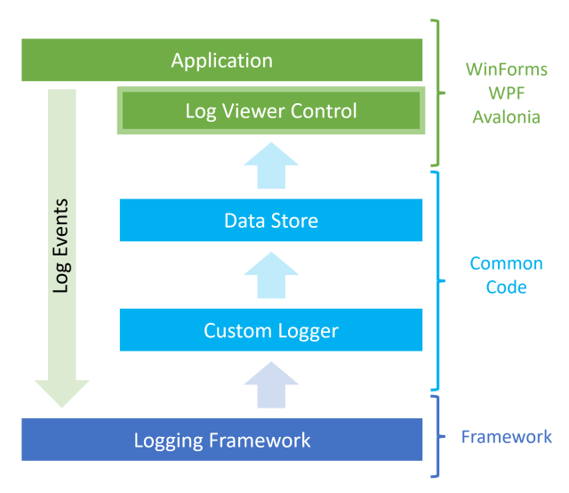
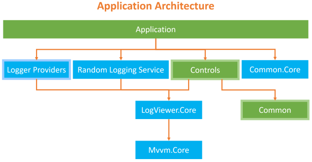
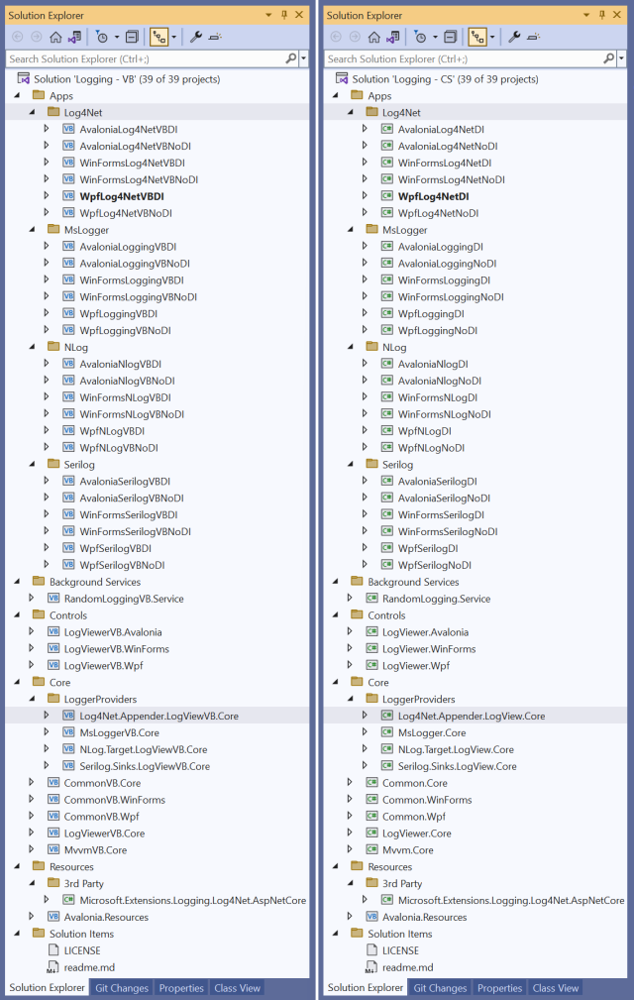
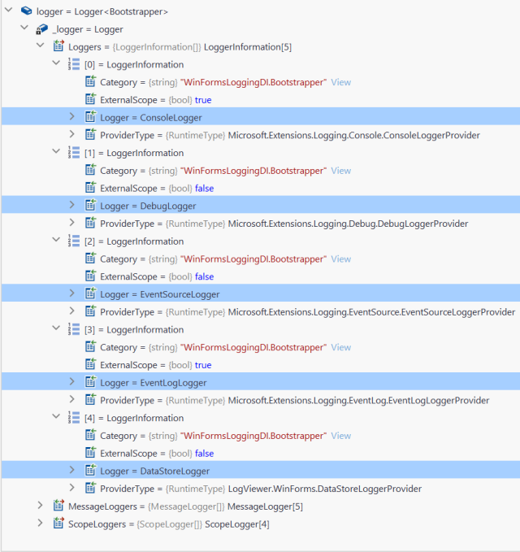
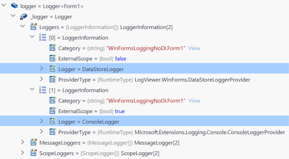
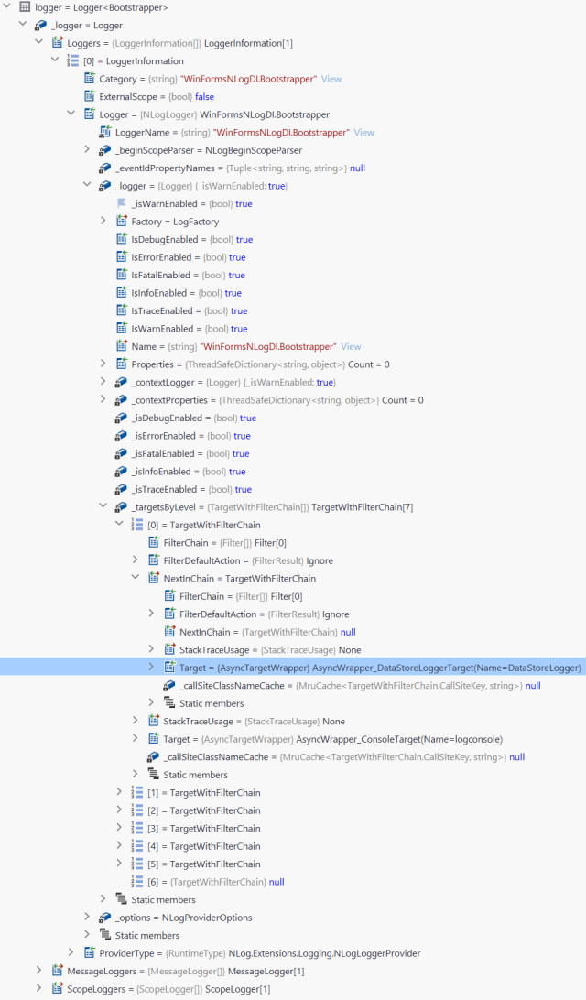
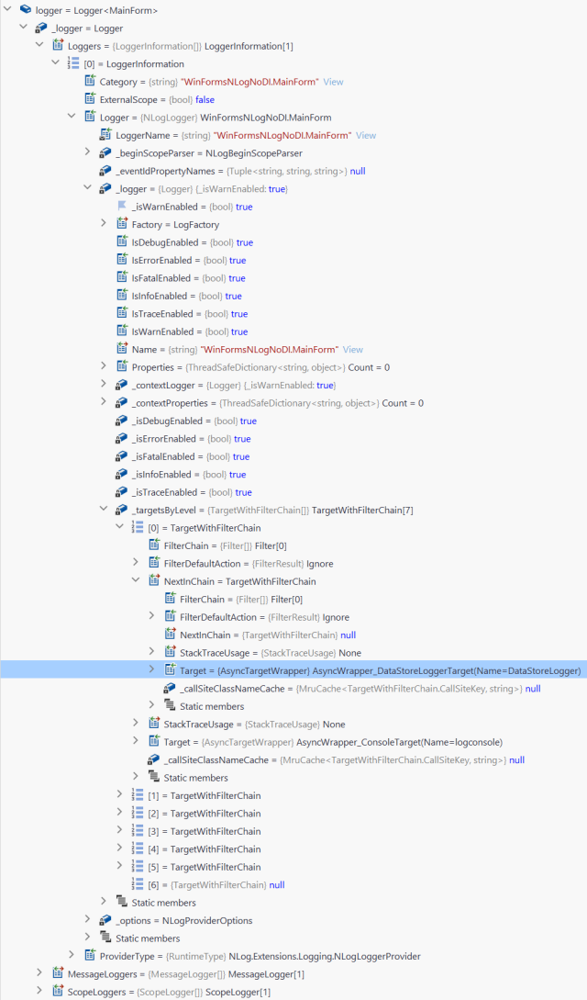
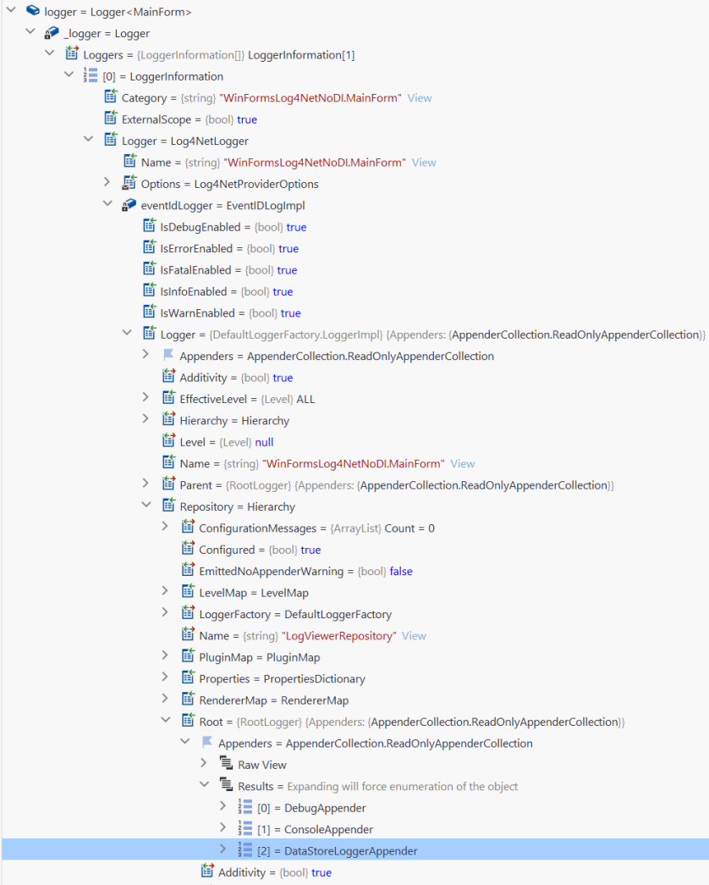

Dot Net Core LogViewer Control for WinForms, Wpf, and Avalonia using the ILogger Framework with Microsoft Logger, Serilog, NLog, and Log4Net in C# & VB on Windows, Mac OS, and Linux
  
**WinForms**, **WPF**, and **Avalonia** LogViewer controls for live viewing of ILogger entries with full colorization support, and more for **C#** and **VB** on **Windows**, **MacOS** and **Linux** using **Microsoft Logger**, **Serilog**, **NLog**, and **Log4Net** + Logging Demystified

## UPDATED March 29th, 2023

* Added support for [Apache Log4Net logging](https://logging.apache.org/log4net/) Services + **WinForms**, **WPF**, and **Avalonia** sample DI & no-DI applications (x6)
* Various code cleanup and optimizations
* Documentation updated with new Log4Net section and improved Solution Setup section

## UPDATED March 28th, 2023

* Added support for [NLog logging](https://nlog-project.org/) platform + **WinForms**, **WPF**, and **Avalonia** sample DI & no-DI applications (x6)
* While implementing NLOG support, found and fixed an issue in `LogViewer.Winforms` project where possible "index out of range" exception occasionally occurs 
 
## Introduction
  
I was working on a solution that required a Viewer for **Logger** entries in the app itself for live viewing of what was happening behind the scene.
  
I wanted something prettier than the console output and something that could be added to a **Winforms**, **WPF**, or **Avalonia** application that felt part of the application, and possibly something that a user may need to view - ie: User Friendly, not the following:
  

  
The requirements for the LoggerViewer are:
  
- Defined as a **control** that could be added or injected via dependency injection
- **Native** for **WinForms**, **WPF**, and **Avalonia** applications
- Support multiple Operating Systems - **Windows**, **MacOS**, **Linux**
- Support multiple Logging Frameworks - **Microsoft** (default), **Serilog**, **NLog**, and **Log4Net**
- Support **colorization** (custom colors as a bonus)
- **Dependency Injection** (DI) and non-DI usage
- **MVVM** (Model View ViewModel design pattern) and non-MVVM usage
- **History** viewable in any list control, a `ListView` / `DataGrid` control
- Selectable **auto-scrolling** to keep the latest entry visible
- **AppSettings.Json** file support for configurable logging
- Capture **framework API logging**
- Work in parallel with other Loggers

We will be looking into Logging - how it works and look at the framework code that makes it work.
  
As we will be covering **WPF**, **WinForms**, and **Avalonia** project types, **Microsoft**, **Serilog**, and **NLog** loggers, and also using / not using Dependency Injection, this article will be a bit lengthy.
  
If you are not interested in how it all works, then see the animations in the Preview section below, download the code, and run the application(s) that are applicable to your use case in the language that you work in.

## Preview

Before we get started, let's look at what we want to achieve. The **WPF**, **WinForms**, and **Avalonia** versions of the `LogViewerControl` look almost identical and work the same for both the **C#** & **VB** versions.

Here is a GIF with **default** colorization for the **WinForms** version in **C#**, using Dependency Injection and data-binding:


Here is a GIF with **custom** colorization for the **WPF** version, minimal implementation in **VB**, no Dependency injection, 3 lines of code:


Lastly, here is proof that you can develop an application for **Mac OS** using **VB**, yes Visual Basic, using the **Avalonia** Framework! Whilst VB is not supported out-of-the-box, as there are no included Application, Class, or Control library templates with the exception of a [Github repository](https://github.com/mevdschee/avalonia-vb-template-app) that is not complete, I will cover how to get **VB** to use the **Avalonia** framework for both application and control project types.


*Note: The 3 animated GIFs may take a moment to load...*

## Contents

<!-- TOC -->
  * [Introduction](#introduction)
  * [Preview](#preview)
  * [Contents](#contents)
  * [Prerequisites](#prerequisites)
  * [Solution Setup](#solution-setup)
    * [Logging Flow](#logging-flow)
    * [Application Architecture](#application-architecture)
    * [Solution Architecture](#solution-architecture)
  * [How Does Logging Work?](#how-does-logging-work)
    * [Logger Internals](#logger-internals)
  * [Custom Loggers](#custom-loggers)
    * [Shared Logging Data](#shared-logging-data)
      * [Storage - `LogDataStore` and `LogModel` classes](#storage---logdatastore-and-logmodel-classes)
      * [Configuration - `DataStoreLoggerConfiguration` class and `LogEntryColor` class](#configuration---datastoreloggerconfiguration-class-and-logentrycolor-class)
    * [Custom Microsoft Logger Implementation](#custom-microsoft-logger-implementation)
      * [Logger - `DataStoreLogger` class](#logger---datastorelogger-class)
      * [Logger Provider - `DataStoreLoggerProvider` class](#logger-provider---datastoreloggerprovider-class)
      * [Registering Microsoft Loggers](#registering-microsoft-loggers)
      * [Registration - `ServicesExtension` class](#registration---servicesextension-class)
      * [Dependency Injection](#dependency-injection)
      * [Manually (without Dependency Injection)](#manually--without-dependency-injection-)
    * [Custom Serilog Logger Implementation](#custom-serilog-logger-implementation)
      * [Logger - `DataStoreLoggerSink` class](#logger---datastoreloggersink-class)
      * [Configuring the Custom Sink - `DataStoreLoggerSinkExtensions` class](#configuring-the-custom-sink---datastoreloggersinkextensions-class)
      * [Registering Sinks (Loggers)](#registering-sinks--loggers-)
      * [Dependency Injection](#dependency-injection-1)
      * [Manually (without Dependency Injection)](#manually--without-dependency-injection--1)
    * [Custom NLog Target Logger Implementation](#custom-nlog-target-logger-implementation)
      * [Logger - `DataStoreLoggerTarget` class](#logger---datastoreloggertarget-class)
      * [Configuring the Custom Target - `ServicesExtension` class](#configuring-the-custom-target---servicesextension-class)
      * [Registering Targets (Loggers)](#registering-targets--loggers-)
      * [Dependency Injection](#dependency-injection-2)
      * [Manually (without Dependency Injection)](#manually--without-dependency-injection--2)
    * [Custom Apache Log4Net Appender Logger Implementation](#custom-apache-log4net-appender-logger-implementation)
      * [Adding missing parts to Microsoft.Extensions.Logging.Log4Net.AspNetCore](#adding-missing-parts-to-microsoftextensionslogginglog4netaspnetcore)
        * [Adding EventID support](#adding-eventid-support)
        * [Adding Dependency Injection support for the Appender support](#adding-dependency-injection-support-for-the-appender-support)
      * [Logger - `DataStoreLoggerAppender` class](#logger---datastoreloggerappender-class)
      * [Configuring the Custom Appender - `ServicesExtension` class](#configuring-the-custom-appender---servicesextension-class)
      * [Registering Appenders (Loggers)](#registering-appenders--loggers-)
      * [Dependency Injection](#dependency-injection-3)
      * [Manually (without Dependency Injection)](#manually--without-dependency-injection--3)
    * [Processing Log Entries](#processing-log-entries)
      * [Dependency Injection](#dependency-injection-4)
      * [Manually (without Dependency Injection)](#manually--without-dependency-injection--4)
      * [Listening for new Entries](#listening-for-new-entries)
      * [Manual Handling of the CollectionChanged events](#manual-handling-of-the-collectionchanged-events)
  * [LogViewerControl Implementation](#logviewercontrol-implementation)
    * [`DispatcherHelper` Class](#dispatcherhelper-class)
      * [WinForms Implementation](#winforms-implementation)
      * [WPF Implementation](#wpf-implementation)
    * [Common code - `LogViewer.Core` project](#common-code---logviewercore-project)
      * [`LoggerExtensions` class](#loggerextensions-class)
    * [ViewModel: `LogViewerControlViewModel` Class](#viewmodel--logviewercontrolviewmodel-class)
    * [WinForms - LogViewerControl](#winforms---logviewercontrol)
      * [Code Behind](#code-behind)
    * [WPF - LogViewerControl](#wpf---logviewercontrol)
      * [Code-behind](#code-behind-1)
      * [User Interface](#user-interface)
    * [Avalonia - LogViewerControl](#avalonia---logviewercontrol)
      * [Code-behind](#code-behind-2)
      * [User Interface](#user-interface-1)
  * [Using the LogViewControl](#using-the-logviewcontrol)
    * [WinForms - Dependency Injection](#winforms---dependency-injection)
      * [Registration - `ServicesExtension` class](#registration---servicesextension-class-1)
      * [`MainForm` Code-Behind](#mainform-code-behind)
      * [Registration - `Bootstrapper` class](#registration---bootstrapper-class)
      * [Usage](#usage)
    * [WinForms - Manually (without Dependency Injection)](#winforms---manually--without-dependency-injection-)
      * [`MainForm` Code-Behind](#mainform-code-behind-1)
    * [WPF - Dependency Injection](#wpf---dependency-injection)
      * [Registration - `ServicesExtension` class](#registration---servicesextension-class-2)
      * [`MainWindow` - `LogViewerControl` Host](#mainwindow---logviewercontrol-host)
      * [`MainViewModel` class](#mainviewmodel-class)
      * [Registration - App (C#) / Application (VB) class](#registration---app--c---application--vb--class)
      * [Usage](#usage-1)
    * [WPF - Manually (without Dependency Injection)](#wpf---manually--without-dependency-injection-)
      * [`MainWindow` XAML - `LogViewerControl` Host](#mainwindow-xaml---logviewercontrol-host)
      * [`MainWindow` Code-behind](#mainwindow-code-behind)
    * [Avalonia - Dependency Injection](#avalonia---dependency-injection)
      * [Registration - `ServicesExtension` class](#registration---servicesextension-class-3)
      * [`MainWindow` - `LogViewerControl` Host](#mainwindow---logviewercontrol-host-1)
      * [`MainViewModel` class](#mainviewmodel-class-1)
      * [Registration - App (C#) / Application (VB) class](#registration---app--c---application--vb--class-1)
      * [Usage](#usage-2)
    * [Avalonia - Manually (without Dependency Injection)](#avalonia---manually--without-dependency-injection-)
      * [`MainWindow` XAML - `LogViewerControl` Host](#mainwindow-xaml---logviewercontrol-host-1)
      * [`MainWindow` Code-behind](#mainwindow-code-behind-1)
  * [Generating Sample Log Messages](#generating-sample-log-messages)
    * [Background Service - `RandomLoggingService` class](#background-service---randomloggingservice-class)
    * [Dependency Injection](#dependency-injection-5)
      * [Registration](#registration)
      * [Usage](#usage-3)
    * [Manually (without Dependency Injection)](#manually--without-dependency-injection--5)
  * [Summary](#summary)
  * [References](#references)
    * [Documentation, Articles, etc](#documentation-articles-etc)
    * [Nuget Packages](#nuget-packages)
  * [History](#history)
<!-- TOC -->
  
## Prerequisites
  
The code that accompanies this article is for Dot Net Core only. Version 7.03 was used and Nullable is enabled. However, if required, it can be modified to support Dot Net 3.1 or later.
  
The Solution was built using **Visual Studio 2022 v17.4.5** and fully tested with **Rider 2022.3.2**.
  
The Nuget Packages that were used for this article are listed in the Nuget Packages reference section at the end of this article.
  
The `AppSettings` helper class was used to simplify reading the configuration settings from the `appsettings*.json` files. There is an article that deep-dives into how this works: [.NET App Settings Demystified (C# & VB | CodeProject)](https://www.codeproject.com/Articles/5354478/NET-App-Settings-Demystified-Csharp-VB).
  
If you are not familiar with Logging then take a moment to read this [Logging in .NET | Microsoft Learn](https://learn.microsoft.com/en-us/dotnet/core/extensions/logging?tabs=command-line) which covers the fundamentals.
  
As we are implementing a Custom Logger and Provider, and you're not familiar with creating a custom logger and provider, please take a moment to read [Implement a custom logging provider in .NET | Microsoft Learn](https://learn.microsoft.com/en-us/dotnet/core/extensions/custom-logging-provider).
  
We will also be covering Dependency Injection (DI). I provide solutions that use and do not use DI, so DI is not essential. If you are interested in learning more, please read this: [Dependency injection in .NET | Microsoft Learn](https://learn.microsoft.com/en-us/dotnet/core/extensions/dependency-injection).
  
Lastly, we will be covering MVVM (Model View ViewModel design pattern). I provide solutions that use and do not use MVVM, so MVVM is not essential. If you are interested in learning more, please read this: [Model-View-ViewModel (MVVM) | Microsoft Learn](https://learn.microsoft.com/en-us/dotnet/architecture/maui/mvvm#the-mvvm-pattern).
  
## Solution Setup
  
As we are covering 3 project types, The structure of the solution attempts to minimize duplication of code. Also, the projects are broken into 4 parts: Application, Controls, Core, and Background Service:

1. Application demonstrates how to implement in your own applications
2. Controls are what you add to your own applications for the UI component
3. Core contains common code, application type-specific code, and the custom logger implementations. The custom logger implementations are independent of the controls, and choose which one or roll your own for another logger framework.
4. The Background Service is simply a dummy service to simulate the generation of logging messages. The Service is common to all application types.

### Logging Flow

We can simplify the design concept with the diagram below:
  

  
The logic flow, as per the diagram above, is as follows:

1. Application logs an event (Trace, Debug, Information, Warning, Error, or Critical) with the appropriate information
2. The Logger Framework passes the Log Event to all registered Loggers, including our custom logger(s)
3. The Loggers store the Log Event in the DataStore
4. The LogViewer control receives a data-binding notification and displays the Log Event

### Application Architecture

The application architecture is the same for all application types:



**NOTES:**
* Application, Controls, and Common parts are UI & application type dependant 
* Logger Providers are Logging Framework specific
* Controls and Common parts are application type specific
* Logger Providers, Random Logging Service, and Controls are all independent of each other

### Solution Architecture

Both **VB** and **C#** solutions are included and have identical layouts. The only difference is the **VB** version has **VB** at the end of the project name.
  


**NOTES:**

- The application project names are made up of 3 parts: **[Application Type][Logger][Implementation]**
    1. Application Type: **Avalonia**, **WinForms**, **Wpf**
    2. Logger: Logger (Default Dot Net Implementation) or Serilog
    3. Implementation: DI = Dependency Injection; NoDI = Manual / No Dependency Injection
- For supporting Projects the Name Suffix identifies the project type
    1. **.Core** for common code
    2. **.Avalonia**, **.WinForms**, **.Wpf** for application-specific types

## How Does Logging Work?
  
Before we dig into the solutions, let us quickly look at how the Dot Net Logging Framework works.
  
There are three parts:

1. Logger
2. Registering Loggers
3. Processing Log Entries

We will be using the [Microsoft Logger Framework](https://learn.microsoft.com/en-us/dotnet/core/extensions/logging). This will allow us to not only capture the application's logging, but all Dot Net (Core) and 3rd-party library logging.
  
The implementation in this article will be using a singleton DataStore for storage, Custom Logger, and Logging Provider. There is also a Configuration class for custom options, like custom colorization.
  
This is just a brief summation and look at the internal code. If you require more information, please the links provided above and in the Reference section at the end of this article.
  
### Logger Internals
  
Loggers are made up of 4 parts:

1. Logger - logging implementation
2. LoggingProvider - Generates the Logger instance
3. Processor / Storage - where the logger outputs the logging to
4. Configuration (optional) - parameters for generating output


  
Every time the `LoggingFactory` creates a `Logger` instance, the `LoggingFactory` will cycle through all of the registered `Logger Providers` and generate internal `Logger` instances for the returned concrete `Logger`. All calls to the `Log` method on the concrete `Logger` will cycle through all of the internal `Logger` instances.
  

  
To understand this better, let's look at the code in the **Dot Net Framework** `LoggerFactory` class that creates the `Logger` instance that we use:

```csharp
public ILogger CreateLogger(string categoryName)
{
    if (CheckDisposed())
    {
        throw new ObjectDisposedException(nameof(LoggerFactory));
    }

    lock (_sync)
    {
        if (!_loggers.TryGetValue(categoryName, out Logger? logger))
        {
            logger = new Logger(CreateLoggers(categoryName));

            (logger.MessageLoggers, logger.ScopeLoggers) = ApplyFilters(logger.Loggers);

            _loggers[categoryName] = logger;
        }

        return logger;
    }
}

private LoggerInformation[] CreateLoggers(string categoryName)
{
    var loggers = new LoggerInformation[_providerRegistrations.Count];
    for (int i = 0; i < _providerRegistrations.Count; i++)
    {
        loggers[i] = new LoggerInformation(_providerRegistrations[i].Provider, categoryName);
    }
    return loggers;
}

internal readonly struct LoggerInformation
{
    public LoggerInformation(ILoggerProvider provider, string category) : this()
    {
        ProviderType = provider.GetType();
        Logger = provider.CreateLogger(category);
        Category = category;
        ExternalScope = provider is ISupportExternalScope;
    }

    public ILogger Logger { get; }

    public string Category { get; }

    public Type ProviderType { get; }

    public bool ExternalScope { get; }
}
```
  
Here we see everything being wired up, including the `LoggerProvier` generating the internal `Loggers` via the `CreateLoggers` method.
  
Then every time we Log an entry via our `Logger`, the information is passed to every internal `Logger`.
  
Here is the concrete **Dot Net Framework** internal `Logger` that is substantiated by the `LoggerFactory`. We will look specifically at the `Log` method:

```csharp
  internal sealed class Logger : ILogger
  {
       public void Log<TState>(LogLevel logLevel, EventId eventId, TState state, Exception? exception, Func<TState, Exception?, string> formatter)
      {
          MessageLogger[]? loggers = MessageLoggers;
          if (loggers == null)
          {
              return;
          }

          List<Exception>? exceptions = null;
          for (int i = 0; i < loggers.Length; i++)
          {
              ref readonly MessageLogger loggerInfo = ref loggers[i];
              if (!loggerInfo.IsEnabled(logLevel))
              {
                  continue;
              }

              LoggerLog(logLevel, eventId, loggerInfo.Logger, exception, formatter, ref exceptions, state);
          }

          if (exceptions != null && exceptions.Count > 0)
          {
              ThrowLoggingError(exceptions);
          }

          static void LoggerLog(LogLevel logLevel, EventId eventId, ILogger logger, Exception? exception, Func<TState, Exception?, string> formatter, ref List<Exception>? exceptions, in TState state)
          {
              try
              {
                  logger.Log(logLevel, eventId, state, exception, formatter);
              }
              catch (Exception ex)
              {
                  exceptions ??= new List<Exception>();
                  exceptions.Add(ex);
              }
          }
      }
      // trimmed
  }
```
  
Here we can see it passes the information to all registered internal `Loggers`.
  
## Custom Loggers
  
The **Dot Net Framework** has a default Microsoft Logger Framework that can be used. There are also many 3rd-party Logging Framework. This article will look at two (2) Logging Frameworks:

1. Microsoft Logger Framework (built-in)
2. Serilog Logger Framework for structured logging

The **LogViewerControl** uses the built in logging framework. For [Serilog](https://serilog.net/), we will look at how to create a custom sink (logger) and hook into the built in logging framework.
  
### Shared Logging Data
  
Before we look at implementing custom loggers, we need to set up log entry storage and logger configuration.
  
#### Storage - `LogDataStore` and `LogModel` classes

```csharp
public interface ILogDataStore
{
    ObservableCollection<LogModel> Entries { get; }
    void AddEntry(LogModel logModel);
}

public class LogDataStore : ILogDataStore
{
    #region Fields

    private static readonly SemaphoreSlim _semaphore = new(initialCount: 1);

    #endregion

    #region Properties

    public ObservableCollection<LogModel> Entries { get; } = new();

    #endregion

    #region Methods

    public virtual void AddEntry(LogModel logModel)
    {
        // ensure only one operation at time from multiple threads
        _semaphore.Wait();

        Entries.Add(logModel);

        _semaphore.Release();
    }

    #endregion
}
```
  
The data model to hold each log entry:

```csharp
public class LogModel
{
    #region Properties

    public DateTime Timestamp { get; set; }

    public LogLevel LogLevel { get; set; }

    public EventId EventId { get; set; }

    public object? State { get; set; }

    public string? Exception { get; set; }

    public LogEntryColor? Color { get; set; }

    #endregion
}
```
  
**NOTES:** The `LogDataStore` class is initialized as a singleton. To process any entries added to the `LogDataStore` class, an `ObservableCollection<T>` is used. For the application to process entries, all that is required is listening to the `CollectionChanged` event for this collection. This will be covered later in the article in the section ???.
  
#### Configuration - `DataStoreLoggerConfiguration` class and `LogEntryColor` class
  
The `DataStoreLoggerConfiguration` class is for optional customization.

```csharp
public class DataStoreLoggerConfiguration
{
    #region Properties
    
    public EventId EventId { get; set; }

    public Dictionary<LogLevel, LogEntryColor> Colors { get; } = new()
    {
        [LogLevel.Trace] = new() { Foreground = Color.DarkGray },
        [LogLevel.Debug] = new() { Foreground = Color.Gray },
        [LogLevel.Information] = new(),
        [LogLevel.Warning] = new() { Foreground = Color.Orange},
        [LogLevel.Error] = new() { Foreground = Color.White, Background = Color.OrangeRed },
        [LogLevel.Critical] = new() { Foreground=Color.White, Background = Color.Red },
        [LogLevel.None] = new(),
    };

    #endregion
}
```
  
The data model to hold each log level display colors:

```csharp
public class LogEntryColor
{
    public Color Foreground { get; set; } = Color.Black;
    public Color Background { get; set; } = Color.Transparent;

}
```
  
### Custom Microsoft Logger Implementation
  
**Microsoft Loggers** are made up of 2 parts, in this case:

1. Logger - `DataStoreLogger`
2. LoggingProvider - `DataStoreLoggerProvider` which will generate the `DataStoreLogger` instance

#### Logger - `DataStoreLogger` class

```csharp
public class DataStoreLogger: ILogger
{
    #region Constructor

    public DataStoreLogger(
        string name,
        Func<DataStoreLoggerConfiguration> getCurrentConfig,
        ILogDataStore dataStore)
    {
        (_name, _getCurrentConfig) = (name, getCurrentConfig);
        _dataStore = dataStore;
    }

    #endregion

    #region Fields

    private readonly ILogDataStore _dataStore;
    private readonly string _name;
    private readonly Func<DataStoreLoggerConfiguration> _getCurrentConfig;

    #endregion

    #region methods

    public IDisposable BeginScope<TState>(TState state)  where TState : notnull => default!;

    public bool IsEnabled(LogLevel logLevel) => true;

    public void Log<TState>(
        LogLevel logLevel,
        EventId eventId,
        TState state,
        Exception? exception,
        Func<TState, Exception, string> formatter)
    {
        // check if we are logging for passed log level
        if (!IsEnabled(logLevel))
            return;

        DataStoreLoggerConfiguration config = _getCurrentConfig();

        _dataStore.AddEntry(new()
        {
            Timestamp = DateTime.UtcNow,
            LogLevel = logLevel,
            // do we override the default EventId if it exists?
            EventId = eventId.Id == 0 && config.EventId != 0 ? config.EventId : eventId,
            State = state,
            Exception = exception?.Message ?? (logLevel == LogLevel.Error ? state?.ToString() ?? "" : ""),
            Color = config.Colors[logLevel],
        });
        
        Debug.WriteLine($"--- [{logLevel.ToString()[..3]}] {_name} - {formatter(state, exception!)}");
    }

    #endregion
}
```
  
**NOTES:** The `Log` method in the custom `DataStoreLogger` adds the log to our `LogDataStore`.
  
#### Logger Provider - `DataStoreLoggerProvider` class

```csharp
public class DataStoreLoggerProvider: ILoggerProvider
{

    #region Constructor
    
    public DataStoreLoggerProvider(
        IOptionsMonitor<DataStoreLoggerConfiguration> config,
        ILogDataStore dataStore)
    {
        _dataStore = dataStore;
        _currentConfig = config.CurrentValue;
        _onChangeToken = config.OnChange(
            updatedConfig => _currentConfig = updatedConfig);
    }

    #endregion

    #region fields
    
    private DataStoreLoggerConfiguration _currentConfig;

    private readonly IDisposable? _onChangeToken;
    protected readonly ILogDataStore _dataStore;

    protected readonly ConcurrentDictionary<string, DataStoreLogger> _loggers = new();
    
    #endregion

    #region Methods
    
    public ILogger CreateLogger(string categoryName)
        => _loggers.GetOrAdd(categoryName, name
            => new DataStoreLogger(name, GetCurrentConfig, _dataStore));

    protected DataStoreLoggerConfiguration GetCurrentConfig()
        => _currentConfig;

    public void Dispose()
    {
        _loggers.Clear();
        _onChangeToken?.Dispose();
    } 

    #endregion
}
```
  
**NOTES:** When the `DataStoreLogger` is created, the `DataStoreLoggerConfiguration` and `LogDataStore` are injected.
  
#### Registering Microsoft Loggers
  
Microsoft Loggers are Registered as a Framework `HostApplicationBuilder` service via the `ILoggingBuilder`.
  
Here is the trimmed code for the **Dot Net Framework** `HostApplicationBuilder` class:

```csharp
/// <summary>
/// A builder for hosted applications and services which helps manage configuration, logging, lifetime and more.
/// </summary>
public sealed class HostApplicationBuilder
{
    private readonly ServiceCollection _serviceCollection = new();

    // trimmed

    public HostApplicationBuilder(HostApplicationBuilderSettings? settings)
    {
        // trimmed
        Logging = new LoggingBuilder(Services);
        // trimmed
    }

    // trimmed

    /// <summary>
    /// A collection of services for the application to compose. This is useful for adding user provided or framework provided services.
    /// </summary>
    public IServiceCollection Services => _serviceCollection;

   /// <summary>
    /// A collection of services for the application to compose. This is useful for adding user provided or framework provided services.
    /// </summary>
    public IServiceCollection Services => _serviceCollection;

    /// <summary>
    /// A collection of logging providers for the application to compose. This is useful for adding new logging providers.
    /// </summary>
    public ILoggingBuilder Logging { get; }

    // trimmed

    private sealed class LoggingBuilder : ILoggingBuilder
    {
        public LoggingBuilder(IServiceCollection services)
        {
            Services = services;
        }

        public IServiceCollection Services { get; }
    }

    // trimmed
}
```
  
#### Registration - `ServicesExtension` class
  
The registration of the `LogDataStore`, `DataStoreLoggerConfiguration`, and `DataStoreLoggerProvider` classes are abstracted to an extension method in the `ServicesExtension` class:

```csharp
public static class ServicesExtension
{
    public static ILoggingBuilder AddDefaultDataStoreLogger(this ILoggingBuilder builder)
    {
        builder.Services.TryAddEnumerable(
            ServiceDescriptor.Singleton<ILoggerProvider, DataStoreLoggerProvider>());
        return builder;
    }

    public static ILoggingBuilder AddDefaultDataStoreLogger(this ILoggingBuilder builder, Action<DataStoreLoggerConfiguration> configure)
    {
        builder.AddDefaultDataStoreLogger();
        builder.Services.Configure(configure);
        return builder;
    }
}
```
  
#### Dependency Injection
  
Here is an example of wiring up the Dependency Injection with the default configuration:

```csharp
HostApplicationBuilder builder = Host.CreateApplicationBuilder();

builder.AddLogViewer();
builder.Logging.AddDefaultDataStoreLogger();

_host = builder.Build();
```
  
Or, if a custom configuration is to be used:

```csharp
HostApplicationBuilder builder = Host.CreateApplicationBuilder();

builder.AddLogViewer();
builder.Logging.AddDefaultDataStoreLogger(options =>
{
    options.Colors[LogLevel.Trace] = new()
    {
        Foreground = Color.White,
        Background = Color.DarkGray
    };
    options.Colors[LogLevel.Debug] = new()
    {
        Foreground = Color.White,
        Background = Color.Gray
    };
    options.Colors[LogLevel.Information] = new()
    {
        Foreground = Color.White,
        Background = Color.DodgerBlue
    };
    options.Colors[LogLevel.Warning] = new()
    {
        Foreground = Color.White,
        Background = Color.Orchid
    };
});

_host = builder.Build();
```
  
To create a logger, you can Inject an instance into a class constructor:

```csharp
public class RandomLoggingService : BackgroundService
{
    #region Constructors

    public RandomLoggingService(ILogger<RandomLoggingService> logger)
        => _logger = logger;

    #endregion

    #region Fields

    private readonly ILogger _logger;

    #endregion
}
```
  
Or request an instance manually:

```csharp
ILogger<class> logger = _host.Services.GetRequiredService<ILogger<class>>();
```
  
And here is a sample screenshot of the logger instance with substantiated logger internals:
  

  
#### Manually (without Dependency Injection)
  
If not using Dependency Injection, it is still possible to register one or more loggers. We will require a singleton class to hold the registration and Factory method for generating Logger instances.
  
Here is the `LoggingHelper` class used with the sample applications in this article:

```csharp
public static class LoggingHelper
{
     #region Constructors

   static LoggingHelper()
    {
        // retrieve the log level from 'appsettings'
        string value = AppSettings<string>.Current("Logging:LogLevel", "Default") ?? "Information";
        Enum.TryParse(value, out LogLevel logLevel);

        // wire up the loggers
        Factory = LoggerFactory.Create(builder => builder

            // visual debugging tools
            .AddDataStoreLogger()

            // examples of adding other loggers...
            .AddSimpleConsole(options =>
            {
                options.SingleLine = true;
                options.TimestampFormat = "hh:mm:ss ";
            })

            // set minimum log level from 'appsettings'
            .SetMinimumLevel(logLevel));
    }

    #endregion

    #region Properties

    public static ILoggerFactory Factory { get; }

    #endregion
}
```
  
Or, if a custom configuration is to be used:

```csharp
public static class LoggingHelper
{
    #region Constructors

    static LoggingHelper()
    {
        // retrieve the log level from 'appsettings'
        string value = AppSettings<string>.Current("Logging:LogLevel", "Default") ?? "Information";
        Enum.TryParse(value, out LogLevel logLevel);

        // wire up the loggers
        Factory = LoggerFactory.Create(builder => builder

            // visual debugging tools
            .AddDataStoreLogger(options =>
            {
                options.Colors[LogLevel.Trace] = new()
                {
                    Foreground = Color.White,
                    Background = Color.DarkGray
                };

                options.Colors[LogLevel.Debug] = new()
                {
                    Foreground = Color.White,
                    Background = Color.Gray
                };

                options.Colors[LogLevel.Information] = new()
                {
                    Foreground = Color.White,
                    Background = Color.DodgerBlue
                };

                options.Colors[LogLevel.Warning] = new()
                {
                    Foreground = Color.White,
                    Background = Color.Orchid
                };
            })

            // examples of adding other loggers...
            .AddSimpleConsole(options =>
            {
                options.SingleLine = true;
                options.TimestampFormat = "hh:mm:ss ";
            })

            // set minimum log level from 'appsettings'
            .SetMinimumLevel(logLevel));
    }

    #endregion

    #region Properties

    public static ILoggerFactory Factory { get; }

    #endregion
}
```
  
To create a logger, use the `Factory` method of the `LoggingHelper` class above:

```csharp
Logger<class> logger = new Logger<class>(LoggingHelper.Factory);
```
  
**NOTE:**
  
When creating Loggers, the class needs to be substantiated/Created. If the class is not, an error will be thrown.
  
Creating the logger as a constructor parameter is acceptable. For example, the following is acceptable:

```csharp
RandomLoggingService service = new(new Logger<RandomLoggingService>(LoggingHelper.Factory));
```
  
And here is a sample screenshot of the logger instance with substantiated logger internals:
  

  
### Custom Serilog Logger Implementation
  
**Serilog Sinks (Loggers)** have a different implementation to the Microsoft Logger implementation. However, to work with the Microsoft Logging Framework, Serilog implements the Logger Provider so the Microsoft Logging Framework can pass data to the Serilog sinks (Logger implementations).
  
#### Logger - `DataStoreLoggerSink` class

```csharp
public class DataStoreLoggerSink : ILogEventSink
{
    protected readonly Func<ILogDataStore> _dataStoreProvider;
    
    private readonly IFormatProvider? _formatProvider;
    private readonly Func<DataStoreLoggerConfiguration>? _getCurrentConfig;

    public DataStoreLoggerSink(Func<ILogDataStore> dataStoreProvider,
                               Func<DataStoreLoggerConfiguration>? getCurrentConfig = null,
                               IFormatProvider? formatProvider = null)
    {
        _formatProvider = formatProvider;
        _dataStoreProvider = dataStoreProvider;
        _getCurrentConfig = getCurrentConfig;
    }

    public void Emit(LogEvent logEvent)
    {
        LogLevel logLevel = logEvent.Level switch
        {
            LogEventLevel.Verbose => LogLevel.Trace,
            LogEventLevel.Debug => LogLevel.Debug,
            LogEventLevel.Warning => LogLevel.Warning,
            LogEventLevel.Error => LogLevel.Error,
            LogEventLevel.Fatal => LogLevel.Critical,
            _ => LogLevel.Information
        };

        DataStoreLoggerConfiguration config =
             _getCurrentConfig?.Invoke() ?? new DataStoreLoggerConfiguration();

        EventId eventId = EventIdFactory(logEvent);
        if (eventId.Id == 0 && config.EventId != 0)
            eventId = config.EventId;

        string message = logEvent.RenderMessage(_formatProvider);
        
        string exception =
            logEvent.Exception?.Message ?? (logEvent.Level >= LogEventLevel.Error
                ? message
                : string.Empty);

        LogEntryColor color = config.Colors[logLevel];

        AddLogEntry(logLevel, eventId, message, exception, color);
    }

    protected virtual void AddLogEntry(
        LogLevel logLevel,
        EventId eventId,
        string message,
        string exception,
        LogEntryColor color)
    {
        ILogDataStore? dataStore = _dataStoreProvider.Invoke();

        // ReSharper disable once ConditionIsAlwaysTrueOrFalseAccordingToNullableAPIContract
        if (dataStore == null)
            return; // app is shutting down

        dataStore.AddEntry(new()
        {
            Timestamp = DateTime.UtcNow,
            LogLevel = logLevel,
            EventId = eventId,
            State = message,
            Exception = exception,
            Color = color
        });
    }

    private static EventId EventIdFactory(LogEvent logEvent)
    {
        EventId eventId;
        if (!logEvent.Properties.TryGetValue("EventId", out LogEventPropertyValue? src))
            return new();
        
        int? id = null;
        string? eventName = null;

        StructureValue? value = src as StructureValue;

        LogEventProperty? idProperty = value!.Properties.FirstOrDefault(x => x.Name.Equals("Id"));
        if (idProperty is not null)
            id = int.Parse(idProperty.Value.ToString());

        LogEventProperty? nameProperty = value.Properties.FirstOrDefault(x => x.Name.Equals("Name"));
        if (nameProperty is not null)
            eventName = nameProperty.Value.ToString().Trim('"');

        eventId = new EventId(id ?? 0, eventName ?? string.Empty);

        return eventId;
    }
}
```
  
#### Configuring the Custom Sink - `DataStoreLoggerSinkExtensions` class
  
Unlike the Microsoft `ILoggerProvider` implementation, the passing of configuration to the custom sink is done differently. There is no Provider, so we encapsulate the process within an extension method.

```csharp
public static class DataStoreLoggerSinkExtensions
{
    public static LoggerConfiguration DataStoreLoggerSink
    (
        this LoggerSinkConfiguration loggerConfiguration,
        Func<ILogDataStore> dataStoreProvider, 
        Action<DataStoreLoggerConfiguration>? configuration = null,
        IFormatProvider formatProvider = null!
    )
        => loggerConfiguration.Sink(
            new DataStoreLoggerSink(
                dataStoreProvider,
                GetConfig(configuration),
                formatProvider));

    private static Func<DataStoreLoggerConfiguration> GetConfig(
        Action<DataStoreLoggerConfiguration>? configuration)
    {
        // convert from Action to Func delegate to pass data
        DataStoreLoggerConfiguration data = new();
        configuration?.Invoke(data);
        return () => data;
    }
}
```
  
#### Registering Sinks (Loggers)
  
Serilog has two methods of registering Sinks:

1. Manually in code
2. Via `appsetting*` configuration file

As we need to inject the Sink configuration, we will be using the first method for the custom sink, however the SeriLog configuration and other sinks will be done via the `appsetting*` configuration file. Below is the configuration used in this article:

```json
{
  "Logging": {
    "LogLevel": {
      "Default": "Information",
      "System.Net.Http.HttpClient": "Information"
    }
  },
  "Serilog": {
    "Using": [ "Serilog.Sinks.File" ],
    "LevelSwitches": { "controlSwitch": "Information" },
    "MinimumLevel": {
      "Default": "Information",
      "Override": {
        "Microsoft": "Information"
      }
    },

    "WriteTo": [
      {
        "Name": "Console",
        "Args": {
          "outputTemplate": "[{Timestamp:HH:mm:ss} {Level:u3}] {EventId.Name} | {Message:lj} {NewLine}{Exception}"
        }
      },
      {
        "Name": "File",
        "Args": {
          "path": "c:\\WIP\\LogData\\log-.txt",
          "rollingInterval": "Day",
          "rollOnFileSizeLimit": true,
          "outputTemplate": "{Timestamp:G} {Message}{NewLine:1}{Exception:1}"
        }
      },
      {
        "Name": "File",
        "Args": {
          "path": "c:\\WIP\\LogData\\log-.json",
          "rollingInterval": "Day",
          "rollOnFileSizeLimit": true,
          "formatter": "Serilog.Formatting.Json.JsonFormatter"
        }
      }
    ],
    "Enrich": [ "FromLogContext", "WithMachineName", "WithProcessId", "WithThreadId" ]
  }
}
```
  
#### Dependency Injection
  
Wiring up Logging with Serilog for use with the Dot Net Logging Framework is different to the Microsoft implementation. We need to manually inject the `LogDataStore` reference after the host service but create the Serilog Logger, and pass the Configuration via Dependency Injection, before the service is built. We do this using a Lambda expression (inline delegate method) that will be called every time a Logger instance is created.
  
Here is an example of wiring up the Dependency Injection with the default configuration:

```csharp
HostApplicationBuilder builder = Host.CreateApplicationBuilder();

builder.AddLogViewer();

IServiceCollection services = builder.Services;

services.AddLogging(configure: cfg =>
{
    Log.Logger = new LoggerConfiguration()
        .ReadFrom.Configuration(builder.Configuration)
        .WriteTo.DataStoreLoggerSink(

            // Use Default Colors
            dataStoreProvider: () => _host!.Services.TryGetService<ILogDataStore>()!)
        .CreateLogger();

    cfg.ClearProviders()
        .AddSerilog(Log.Logger);
});

_host = builder.Build();
```
  
Or, if a custom configuration is to be used:

```csharp
HostApplicationBuilder builder = Host.CreateApplicationBuilder();

builder.AddLogViewer();
IServiceCollection services = builder.Services;

services.AddLogging(configure: cfg =>
{
    Log.Logger = new LoggerConfiguration()
        .ReadFrom.Configuration(builder.Configuration)
        .WriteTo.DataStoreLoggerSink(

        // Use Custom Colors
        dataStoreProvider: () => _host!.Services.TryGetService<ILogDataStore>()!,
        options =>
        {
            options.Colors[LogLevel.Trace] = new()
            {
                Foreground = Color.White,
                Background = Color.DarkGray
            };
        
            options.Colors[LogLevel.Debug] = new()
            {
                Foreground = Color.White,
                Background = Color.Gray
            };
        
            options.Colors[LogLevel.Information] = new()
            {
                Foreground = Color.White,
                Background = Color.DodgerBlue
            };
        
            options.Colors[LogLevel.Warning] = new()
            {
                Foreground = Color.White,
                Background = Color.Orchid
            };
        })
        .CreateLogger();

    cfg.ClearProviders()
        .AddSerilog(Log.Logger);
});

_host = builder.Build();
```
  
**NOTE:**

- We store a reference to the Logger factory instance so that when the application closes, we can flush the buffers for all sinks, like for file or remote storage.

To create a logger, you can Inject an instance into a class constructor:

```csharp
public class RandomLoggingService : BackgroundService
{
    #region Constructors

    public RandomLoggingService(ILogger<RandomLoggingService> logger)
        => _logger = logger;

    #endregion

    #region Fields

    private readonly ILogger _logger;

    #endregion
}
```
  
Or request an instance manually:

```csharp
ILogger<class> logger = _host.Services.GetRequiredService<ILogger<class>>();
```
  
And here is a sample screenshot of the logger instance with substantiated logger internals:
  

  
#### Manually (without Dependency Injection)
  
If not using Dependency Injection, it is still possible to register one or more loggers. We will require a singleton class to hold the registration and Factory method for generating Logger instances.
  
Here is the `LoggingHelper` class used with the sample applications in this article.

```csharp
public static class LoggingHelper
{
    #region Constructors

    static LoggingHelper()
    {
        IConfigurationRoot configuration = new ConfigurationBuilder()
            .Initialize()
            .Build();

        Log.Logger = new LoggerConfiguration()
            .ReadFrom.Configuration(configuration)
            .WriteTo.DataStoreLoggerSink(
            
                // Use Default Colors
                dataStoreProvider: () => MainControlsDataStore.DataStore)
            .CreateLogger();

        // wire up the loggers
        Factory = LoggerFactory.Create(loggingBuilder => loggingBuilder.AddSerilog(Log.Logger));
    }

    #endregion

    #region Properties

    public static ILoggerFactory Factory { get; }

    #endregion

    #region Methods

    public static void CloseAndFlush()
        => Log.CloseAndFlush();

    #endregion
}
```
  
Or, if a custom configuration is to be used:

```csharp
public static class LoggingHelper
{
    #region Constructors

    static LoggingHelper()
    {
        IConfigurationRoot configuration = new ConfigurationBuilder()
            .Initialize()
            .Build();

        Log.Logger = new LoggerConfiguration()
            .ReadFrom.Configuration(configuration)
            .WriteTo.DataStoreLoggerSink(
                dataStoreProvider: () => MainControlsDataStore.DataStore,
                options =>
                {
                    options.Colors[LogLevel.Trace] = new()
                    {
                        Foreground = Color.White,
                        Background = Color.DarkGray
                    };

                    options.Colors[LogLevel.Debug] = new()
                    {
                        Foreground = Color.White,
                        Background = Color.Gray
                    };

                    options.Colors[LogLevel.Information] = new()
                    {
                        Foreground = Color.White,
                        Background = Color.DodgerBlue
                    };

                    options.Colors[LogLevel.Warning] = new()
                    {
                        Foreground = Color.White,
                        Background = Color.Orchid
                    };
                }
            )
            .CreateLogger();

        // wire up the loggers
        Factory = LoggerFactory.Create(loggingBuilder => loggingBuilder.AddSerilog(Log.Logger));
    }

    #endregion

    #region Properties

    public static ILoggerFactory Factory { get; }

    #endregion

    #region Methods

    public static void CloseAndFlush()
        => Log.CloseAndFlush();

    #endregion
}
```
  
To create a logger, use the `Factory` method of the `LoggingHelper` class above:

```csharp
Logger<class> logger = new Logger<class>(LoggingHelper.Factory);
```
  
**NOTE:**
  
When creating Loggers, the class needs to be substantiated/Created. If the class is not, an error will be thrown.
  
Creating the logger as a constructor parameter is acceptable. For example, the following is acceptable:

```csharp
RandomLoggingService service = new(new Logger<RandomLoggingService>(LoggingHelper.Factory));
```
  
And here is a sample screenshot of the logger instance with substantiated logger internals:
  


### Custom NLog Target Logger Implementation

**NLog** Targets (Loggers) have a different implementation to the Microsoft Logger implementation. However, to work with the Microsoft Logging Framework, **NLog** implements the Logger Provider internally so the Microsoft Logging Framework can pass data to the **NLog** Targets (Logger implementations).

When implementing a custom NLog target, the target must be registered, then enabled in the configuration file. We will be implementing the NLog configuration in the `appsetting*.json` file. 

#### Logger - `DataStoreLoggerTarget` class
```csharp
[Target("DataStoreLogger")]
public class DataStoreLoggerTarget : TargetWithLayout
{
    #region Fields

    private ILogDataStore? _dataStore;
    private DataStoreLoggerConfiguration? _config;

    #endregion

    #region methods

    protected override void InitializeTarget()
    {
        // we need to inject dependencies
        IServiceProvider serviceProvider = ResolveService<IServiceProvider>();

        // reference the shared instance
        _dataStore = serviceProvider.GetRequiredService<ILogDataStore>();

        // load the config options
        IOptionsMonitor<DataStoreLoggerConfiguration>? options
            = serviceProvider.GetService<IOptionsMonitor<DataStoreLoggerConfiguration>>();

        _config = options?.CurrentValue ?? new DataStoreLoggerConfiguration();

        base.InitializeTarget();
    }

    protected override void Write(LogEventInfo logEvent)
    {
        // cast NLog Loglevel to Microsoft LogLevel type
        MsLogLevel logLevel = (MsLogLevel)Enum.ToObject(typeof(MsLogLevel), logEvent.Level.Ordinal);

        // format the message
        string message = RenderLogEvent(Layout, logEvent);

        // retrieve the EventId
        EventId eventId = (EventId)logEvent.Properties["EventId"];

        // add log entry
        _dataStore?.AddEntry(new()
        {
            Timestamp = DateTime.UtcNow,
            LogLevel = logLevel,
            // do we override the default EventId if it exists?
            EventId = eventId.Id == 0 && (_config?.EventId.Id ?? 0) != 0 ? _config!.EventId : eventId,
            State = message,
            Exception = logEvent.Exception?.Message ?? (logLevel == MsLogLevel.Error ? message : ""),
            Color = _config!.Colors[logLevel],
        });
        
        Debug.WriteLine($"--- [{logLevel.ToString()[..3]}] {message} - {logEvent.Exception?.Message ?? "no error"}");
    }

    #endregion
}
```

#### Configuring the Custom Target - `ServicesExtension` class
```csharp
public static class ServicesExtension
{
    public static ILoggingBuilder AddNLogTargets(this ILoggingBuilder builder, IConfiguration config)
    {
        LogManager
            .Setup()
            // Register custom Target
            .SetupExtensions(extensionBuilder =>
                extensionBuilder.RegisterTarget<DataStoreLoggerTarget>("DataStoreLogger"));

        builder
            .ClearProviders()
            .SetMinimumLevel(MsLogLevel.Trace)
            .AddNLog(config,
                new NLogProviderOptions
                {
                    IgnoreEmptyEventId = false,
                    CaptureEventId = EventIdCaptureType.Legacy
                });

        return builder;
    }

    public static ILoggingBuilder AddNLogTargets(this ILoggingBuilder builder, IConfiguration config, Action<DataStoreLoggerConfiguration> configure)
    {
        builder.AddNLogTargets(config);
        builder.Services.Configure(configure);
        return builder;
    }
}
```
#### Registering Targets (Loggers)
NLog has two methods of registering Sinks:
1. Manually in code
2. Via `appsetting*` configuration file

As we need to inject the Target configuration, we will be using the second method for the custom target, and registering the Custom Target in code, as above. Below is the configuration used in this article:
```json
{
  "Logging": {
    "LogLevel": {
      "Default": "Information",
      "System.Net.Http.HttpClient": "Information"
    }
  },
  "NLog": {
    "throwConfigExceptions": true,
    "targets": {
      "async": true,
      "logconsole": {
        "type": "Console",
        "layout": "${longdate}|${level}|${message} |${all-event-properties} ${exception:format=tostring}"
      },
      "DataStoreLogger": {
        "type": "DataStoreLogger",
        "layout": "${message}"
      }
    },
    "rules": [
      {
        "logger": "*",
        "minLevel": "Info",
        "writeTo": "logconsole, DataStoreLogger"
      }
    ]
  }
}
```
#### Dependency Injection

The `ServicesExtension` class and `appsetting*` configuration file wires up the registration of the Targets, including our custom target , and configures NLog to work with the Dot Net Logging Framework. Now we need to tell the Host to use NLog Logging.

Here is an example of wiring up the Dependency Injection with the default configuration:

```csharp
HostApplicationBuilder builder = Host.CreateApplicationBuilder();

builder.AddLogViewer();

builder.Logging.AddNLogTargets(builder.Configuration);

_host = builder.Build();
```
Or, if a custom configuration is to be used:

```csharp
HostApplicationBuilder builder = Host.CreateApplicationBuilder();

builder.AddLogViewer();

builder.Logging.AddNLogTargets(builder.Configuration, options =>
{
    options.Colors[LogLevel.Trace] = new()
    {
        Foreground = Color.White,
        Background = Color.DarkGray
    };

    options.Colors[LogLevel.Debug] = new()
    {
        Foreground = Color.White,
        Background = Color.Gray
    };

    options.Colors[LogLevel.Information] = new()
    {
        Foreground = Color.White,
        Background = Color.DodgerBlue
    };

    options.Colors[LogLevel.Warning] = new()
    {
        Foreground = Color.White,
        Background = Color.Orchid
    };
});

_host = builder.Build();
```

To create a logger, you can Inject an instance into a class constructor:

```csharp
public class RandomLoggingService : BackgroundService
{
#region Constructors

    public RandomLoggingService(ILogger<RandomLoggingService> logger)
        => _logger = logger;

    #endregion

    #region Fields

    private readonly ILogger _logger;

    #endregion
}
```
Or request an instance manually:

```csharp
ILogger<class> logger = _host.Services.GetRequiredService<ILogger<class>>();
```

And here is a sample screenshot of the logger instance with substantiated logger internals:



#### Manually (without Dependency Injection)

If not using Dependency Injection, it is still possible to register one or more loggers. 

We will need to wrap the `ServicesExtension` used for Dependency Injection to use the non-DI version of `LogDataStore` class:

```csharp
public static class ServicesExtension
{
    public static ILoggingBuilder AddNLogTargetsNoDI(this ILoggingBuilder builder, IConfiguration config)
    {
        // We need to use a shared instance of the DataStore to pass to the LogViewerControl
        builder.Services.AddSingleton(MainControlsDataStore.DataStore);

        // call core NLog ServiceExtension initializer
        builder.AddNLogTargets(config);

        return builder;
    }

    public static ILoggingBuilder AddNLogTargetsNoDI(this ILoggingBuilder builder, IConfiguration config, Action<DataStoreLoggerConfiguration> configure)
    {
        builder.AddNLogTargetsNoDI(config);
        builder.Services.Configure(configure);
        return builder;
    }
}
```

We will also require a singleton class to hold the registration and Factory method for generating Logger instances. Here is the LoggingHelper class used with the sample applications in this article.

```csharp
public static class LoggingHelper
{
    #region Constructors

    static LoggingHelper()
    {
        // retrieve the log level from 'appsettings'
        string value = AppSettings<string>.Current("Logging:LogLevel", "Default") ?? "Information";
        Enum.TryParse(value, out LogLevel logLevel);

        IConfigurationRoot configuration = new ConfigurationBuilder()
            .Initialize()
            .Build();

        // wire up the loggers
        Factory = LoggerFactory.Create(builder => builder

            // visual debugging tools
            .AddNLogTargetsNoDI(configuration)

            // set minimum log level from 'appsettings*.json'
            .SetMinimumLevel(logLevel));
    }

    #endregion

    #region Properties

    public static ILoggerFactory Factory { get; }

    #endregion
}
```

Or, if a custom configuration is to be used:

```csharp
public static class LoggingHelper
{
    #region Constructors

    static LoggingHelper()
    {
        // retrieve the log level from 'appsettings'
        string value = AppSettings<string>.Current("Logging:LogLevel", "Default") ?? "Information";
        Enum.TryParse(value, out LogLevel logLevel);

        IConfigurationRoot configuration = new ConfigurationBuilder()
            .Initialize()
            .Build();


        // wire up the loggers
        Factory = LoggerFactory.Create(builder => builder

            // visual debugging tools
            .AddNLogTargets(configuration, options =>
            {
                options.Colors[LogLevel.Trace] = new()
                {
                    Foreground = Color.White,
                    Background = Color.DarkGray
                };

                options.Colors[LogLevel.Debug] = new()
                {
                    Foreground = Color.White,
                    Background = Color.Gray
                };

                options.Colors[LogLevel.Information] = new()
                {
                    Foreground = Color.White,
                    Background = Color.DodgerBlue
                };

                options.Colors[LogLevel.Warning] = new()
                {
                    Foreground = Color.White,
                    Background = Color.Orchid
                };
            })

            // set minimum log level from 'appsettings*.json'
            .SetMinimumLevel(logLevel));
    }

    #endregion

    #region Properties

    public static ILoggerFactory Factory { get; }

    #endregion
}
```

To create a logger, use the Factory method of the LoggingHelper class above:
```csharp
Logger<class> logger = new Logger<class>(LoggingHelper.Factory);
```

**NOTE:**
* When creating Loggers, the class needs to be substantiated/Created. If the class is not, an error will be thrown.

Creating the logger as a constructor parameter is acceptable. For example, the following is acceptable:

```csharp
RandomLoggingService service = new(new Logger<RandomLoggingService>(LoggingHelper.Factory));
```

And here is a sample screenshot of the logger instance with substantiated logger internals:



!!! WIP START !!!

### Custom Apache Log4Net Appender Logger Implementation

Whilst Log4Net supports the Dot Net Framework (.NET Core 1.0 providing .NET Standard 1.3), Log4Net was the most involved to implement as there were:
* No native support for Dependency Injection for both the Logging system and Custom Appenders
* No support for logging with the `EventID` or other custom properties

Doing research I did find an open source project [huorswords / Microsoft.Extensions.Logging.Log4Net.AspNetCore](https://github.com/huorswords/Microsoft.Extensions.Logging.Log4Net.AspNetCore) on GitHub that supported Dependency Injection with the Dot Net Framework, however, was missing requirements for:
* No Dependency Injection for Custom Appenders
* No support for logging with the `EventID` or other custom properties

You can read more about this project here: [How to use Log4Net with ASP.NET Core for logging | DotNetThoughts Blog](https://dotnetthoughts.net/how-to-use-log4net-with-aspnetcore-for-logging/). Please note, the name of the project is a little misleading. It is not specific to just AspNetCore. It will work with other application project types.

#### Adding missing parts to Microsoft.Extensions.Logging.Log4Net.AspNetCore

Whilst two (2) key requirements were missing, it is an open-source project, so we can update the project with the missing parts. The following section will cover how we achieved this by adding backward-compatible support with the current implementation to avoid any breaking changes. 

I will be creating a pull request for the missing parts. However, for now, I have included the updated project with the download for this article.

##### Adding EventID support

There was no official documentation on how to add features to the internal Log4Net logger. Luckily, I found on the official Log4Net repository an example of how to do this:  [http://svn.apache.org/logging/log4net](http://svn.apache.org/viewvc/logging/log4net/trunk/examples/net/2.0/Extensibility/EventIDLogApp/cs/src/).

There are three (3) parts to adding EventId support:
1. Wrap the base Log4Net `Logger` implementation (Interface + Class)
2. Update `Log4NetLogger` class in `Microsoft.Extensions.Logging.Log4Net.AspNetCore` to use the new logger class

Following is the implementation used:

1. `Logger` wrapper

   a`IEventIDLog` Interface

    ```csharp
    public interface IEventIDLog : ILog
    {
        void Log(EventId eventId, LoggingEvent loggingEvent);
    }
    ```

    b. `EventIDLogImpl` class

    ```csharp
    public class EventIDLogImpl : LogImpl, IEventIDLog
    {
        public EventIDLogImpl(log4net.Core.ILogger logger) : base(logger) { /* skip */ }
    
        #region Implementation of IEventIDLog
    
        public void Log(EventId eventId, LoggingEvent loggingEvent)
        {
            // is the EventId empty?
            if (!(eventId.Id == 0 && string.IsNullOrWhiteSpace(eventId.Name)))
                loggingEvent.Properties[nameof(EventId)] = eventId;
    
            Logger.Log(loggingEvent);
        }
    
        #endregion
    }
    ```

2. Update `Log4NetLogger` class

I will only be showing the changes made - we change the implementation and now can inject the missing `EventId` reference.

```csharp
public class Log4NetLogger : ILogger
{
    private readonly IEventIDLog eventIdLogger;

    public void Log<TState>(
        LogLevel logLevel,
        EventId eventId,
        TState state,
        Exception exception,
        Func<TState, Exception, string> formatter)
    {
        if (!this.IsEnabled(logLevel))
        {
            return;
        }

        EnsureValidFormatter(formatter);

        var candidate = new MessageCandidate<TState>(logLevel, eventId, state, exception, formatter);

        LoggingEvent loggingEvent = options.LoggingEventFactory.CreateLoggingEvent(in candidate, eventIdLogger.Logger, options, externalScopeProvider);

        if (loggingEvent == null)
            return;

        this.eventIdLogger.Log(eventId, loggingEvent);
    }
}
```

##### Adding Dependency Injection support for the Appender support

This has 2 parts:
1. Wrapping the base `AppenderSkeleton` class with DI support
2. Updating the `Log4NetProvider` class to prepare the `AppenderSkeleton` class for DI support

Following is the implementation used:

1. `ServiceAppenderSkeleton` wrapper class for DI support

We define and internal explicit method for setting the DI service provider reference and a protected method that can be used from within our custom appender to resolve any required dependencies.

```csharp
internal interface IAppenderServiceProvider
{
    IServiceProvider ServiceProvider { set; }
}

public abstract class ServiceAppenderSkeleton
    : AppenderSkeleton, IServiceAppenderSkeleton, IDisposable
{
    private IServiceProvider _serviceProvider;
    IServiceProvider IAppenderServiceProvider.ServiceProvider
    {
        set => _serviceProvider = value;
    }

    protected T ResolveService<T>() where T : class
    {
        if (_serviceProvider == null)
            return default;

        return _serviceProvider.GetService<T>();
    }

    public void Dispose() => _serviceProvider = null;
}
```

2. Updating the `Log4NetProvider` class

I will only be showing the changes made to add a DI service provider reference to the Appenders that implement the `IAppenderServiceProvider` interface.

```csharp
public class Log4NetProvider : ILoggerProvider, ISupportExternalScope
{
    #region IOC implementation

    public Log4NetProvider(IServiceProvider serviceCollection)
        : this(new Log4NetProviderOptions(), serviceCollection)
    {
    }

    public Log4NetProvider(string log4NetConfigFileName, IServiceProvider serviceProvider)
        : this(new Log4NetProviderOptions(log4NetConfigFileName), serviceProvider)
    {
    }

    public Log4NetProvider(Log4NetProviderOptions options, IServiceProvider serviceProvider)
    {
        this.serviceProvider = serviceProvider;

        this.SetOptionsIfValid(options);

        Assembly loggingAssembly = GetLoggingReferenceAssembly();

        this.CreateLoggerRepository(loggingAssembly)
            .ConfigureLog4NetLibrary(loggingAssembly);
    }

    private IServiceProvider serviceProvider;

    #endregion

    private Log4NetProvider ConfigureLog4NetLibrary(Assembly assembly)
    {
        if (this.options.UseWebOrAppConfig)
        {
            XmlConfigurator.Configure(this.Repository);
            return this;
        }

        if (!this.options.ExternalConfigurationSetup)
        {
            string fileNamePath = CreateLog4NetFilePath(assembly);
            if (this.options.Watch)
            {
                XmlConfigurator.ConfigureAndWatch(
                    this.Repository,
                    new FileInfo(fileNamePath));
            }
            else
            {
                var configXml = ParseLog4NetConfigFile(fileNamePath);
                if (this.options.PropertyOverrides != null
                    && this.options.PropertyOverrides.Any())
                {
                    configXml = UpdateNodesWithOverridingValues(
                        configXml,
                        this.options.PropertyOverrides);
                }

                XmlConfigurator.Configure(this.Repository, configXml.DocumentElement);
            }
        }

        this.InjectServices();

        return this;
    }

    private void InjectServices()
    {
        if (this.Repository is null)
            return;
        
        IEnumerable<IAppenderServiceProvider> adapters =
            this.Repository
                .GetAppenders()
                .OfType<IAppenderServiceProvider>();

        foreach (IAppenderServiceProvider adapter in adapters)
            adapter.ServiceProvider = serviceProvider;
    }
}
```
#### Logger - `DataStoreLoggerAppender` class

```csharp
public class DataStoreLoggerAppender : AppenderServiceProvider
{
    #region Fields

    private ILogDataStore? _dataStore;
    private DataStoreLoggerConfiguration? _options;
    
    private IServiceProvider? _serviceProvider;
    
    #endregion

    #region Methods

    protected override void Append(LoggingEvent loggingEvent)
    {
        if (_serviceProvider is null)
            Initialize();

        // cast matching Log4Net Loglevel to Microsoft LogLevel type
        LogLevel logLevel = loggingEvent.Level.Value switch 
        {
            int.MaxValue => LogLevel.None,
            120000 => LogLevel.Debug,
            90000 => LogLevel.Critical,
            70000 => LogLevel.Error,
            60000 => LogLevel.Warning,
            20000 => LogLevel.Trace,
            _ => LogLevel.Information
        };

        DataStoreLoggerConfiguration config = _options ?? new DataStoreLoggerConfiguration();

        EventId? eventId = (EventId?)loggingEvent.LookupProperty(nameof(EventId));
        eventId = eventId is null && config.EventId.Id != 0 ? config.EventId : eventId;

        string message = loggingEvent.RenderedMessage ?? string.Empty;
        
        string exceptionMessage = loggingEvent.GetExceptionString();

        _dataStore!.AddEntry(new()
        {
            Timestamp = DateTime.UtcNow,
            LogLevel = logLevel,
            EventId = eventId ?? new(),
            State = message,
            Exception = exceptionMessage,
            Color = config.Colors[logLevel],
        });

        Debug.WriteLine($"--- [{logLevel.ToString()[..3]}] {message} - {exceptionMessage ?? "no error"}");
    }

    private void Initialize()
    {
        _serviceProvider = ResolveService<IServiceProvider>();
        _dataStore = _serviceProvider.GetRequiredService<ILogDataStore>();
        _options = _serviceProvider.GetService<DataStoreLoggerConfiguration>();
    }

    #endregion
}
```

#### Configuring the Custom Appender - `ServicesExtension` class

```csharp
public static class Log4NetExtensions
{
    public static ILoggingBuilder AddLog4Net(this ILoggingBuilder builder, IConfiguration config)
        => builder
            .ClearProviders()
            .AddLog4Net(config.GetLog4NetConfiguration());

    public static ILoggingBuilder AddLog4Net(this ILoggingBuilder builder, IConfiguration config, Action<DataStoreLoggerConfiguration> configure)
    {
        builder
            .AddLog4Net(config)
            .Services.Configure(configure);

        return builder;
    }

    public static Log4NetProviderOptions? GetLog4NetConfiguration(this IConfiguration configuration)
        => configuration
            .GetSection("Log4NetCore")
            .Get<Log4NetProviderOptions>();
}
```

#### Registering Appenders (Loggers)

Log4Net is restricted to using an XML config file. Default name is `log4net.config`. It is possible to change the name of this file. However, for the purpose of this article, we will not be focusing on this.

```xml
<?xml version="1.0" encoding="utf-8" ?>
<log4net>
	<appender name="DebugAppender" type="log4net.Appender.DebugAppender" >
		<layout type="log4net.Layout.PatternLayout">
			<conversionPattern value="%date [%thread] %-5level %logger - %message%newline" />
		</layout>
	</appender>
	<appender name="ConsoleAppender" type="log4net.Appender.ConsoleAppender">
		<threshold value="ALL" />
		<layout type="log4net.Layout.PatternLayout">
			<conversionPattern value="%date [%thread] %-5level %logger - %message%newline" />
		</layout>
	</appender>
	<appender name="DataStoreLogger" type="Log4Net.Appender.LogView.Core.DataStoreLoggerAppender">
		<threshold value="ALL" />
	</appender>
	<root>
		<Level value="ALL" />
		<appender-ref ref="DebugAppender" />
		<appender-ref ref="ConsoleAppender" />
		<appender-ref ref="DataStoreLogger" />
	</root>
</log4net>
```

Luckily, the `Microsoft.Extensions.Logging.Log4Net.AspNetCore` project includes support for overriding values in the `log4net.config` file. This allows us to support different configurations for each launch profile using `appsettings*.json` file(s).

Here is our `appsettings.Production.json` file:
```json
{
  "Logging": {
    "LogLevel": {
      "Default": "Trace",
      "System.Net.Http.HttpClient": "Trace"
    }
  },
  "Log4NetCore": {
    "Name": "Log4NetLogViewer_Prod",
    "LoggerRepository": "LogViewerRepository",
    "OverrideCriticalLevelWith": "Critical",
    "Watch": false,
    "UseWebOrAppConfig": false,
    "PropertyOverrides": [
      {
        "XPath": "/log4net/appender[@name='ConsoleAppender']/layout/conversionPattern",
        "Attributes": {
          "Value": "%date [%thread] %-5level | %logger | %message%newline"
        }
      },
      {
        "XPath": "/log4net/appender[@name='ConsoleAppender']/threshold",
        "Attributes": {
          "Value": "Warn"
        }
      },
      {
        "XPath": "/log4net/appender[@name='DataStoreLogger']/threshold",
        "Attributes": {
          "Value": "Warn"
        }
      }
    ]
  }
}
```

**NOTES:**
* The default logging levels in the `log4net.config` is for all levels, however, for Production/Release, the `appsettings.Production.json` file overrides with `Warn` for `Warning`, `Error`, and `Critical` levels.

#### Dependency Injection

The `ServicesExtension` class and `log4net.config` configuration file wires up the registration of the Appenders, including our custom appender, and configures **Log4Het** to work with the **Dot Net Logging Framework**. Now we need to tell the Host to use Log4Net Logging.

Here is an example of wiring up the Dependency Injection with the default configuration:

```csharp
HostApplicationBuilder builder = Host.CreateApplicationBuilder();

builder.AddLogViewer();

builder.Logging.AddLog4Net(builder.Configuration);

_host = builder.Build();
```

Or, if a custom configuration is to be used:

```csharp
HostApplicationBuilder builder = Host.CreateApplicationBuilder();

builder.AddLogViewer();

builder.Logging.AddLog4Net(builder.Configuration, options =>
{
options.Colors[LogLevel.Trace] = new()
{
Foreground = Color.White,
Background = Color.DarkGray
};

    options.Colors[LogLevel.Debug] = new()
    {
        Foreground = Color.White,
        Background = Color.Gray
    };

    options.Colors[LogLevel.Information] = new()
    {
        Foreground = Color.White,
        Background = Color.DodgerBlue
    };

    options.Colors[LogLevel.Warning] = new()
    {
        Foreground = Color.White,
        Background = Color.Orchid
    };
});

_host = builder.Build();
```

To create a logger, you can Inject an instance into a class constructor:

```csharp
public class RandomLoggingService : BackgroundService
{
#region Constructors

    public RandomLoggingService(ILogger<RandomLoggingService> logger)
        => _logger = logger;

    #endregion

    #region Fields

    private readonly ILogger _logger;

    #endregion
}
```
Or request an instance manually:

```csharp
ILogger<class> logger = _host.Services.GetRequiredService<ILogger<class>>();
```

And here is a sample screenshot of the logger instance with substantiated logger internals:


#### Manually (without Dependency Injection)

If not using Dependency Injection, it is still possible to register one or more loggers.

We will need to wrap the ServicesExtension used for Dependency Injection to use the non-DI version of LogDataStore class:

```csharp
public static class LoggerExtension
{
    public static ILoggingBuilder AddLog4NetNoDI(this ILoggingBuilder builder, IConfiguration config)
    {
        // We need to use a shared instance of the DataStore to pass to the LogViewerControl
        builder.Services.AddSingleton(MainControlsDataStore.DataStore);

        // call core NLog ServiceExtension initializer
        builder.AddLog4Net(config);

        return builder;
    }

    public static ILoggingBuilder AddLog4NetNoDI(this ILoggingBuilder builder, IConfiguration config, Action<DataStoreLoggerConfiguration> configure)
    {
        builder.AddLog4NetNoDI(config);
        builder.Services.Configure(configure);
        return builder;
    }
}
```

We will also require a singleton class to hold the registration and Factory method for generating Logger instances. Here is the LoggingHelper class used with the sample applications in this article.

```csharp
public static class LoggingHelper
{
#region Constructors

    static LoggingHelper()
    {
        // retrieve the log level from 'appsettings'
        string value = AppSettings<string>.Current("Logging:LogLevel", "Default") ?? "Information";
        Enum.TryParse(value, out LogLevel logLevel);

        IConfigurationRoot configuration = new ConfigurationBuilder()
            .Initialize()
            .Build();

        // wire up the loggers
        Factory = LoggerFactory.Create(builder => builder

            // visual debugging tools
            .AddLog4NetNoDI(configuration)

            // set minimum log level from 'appsettings*.json'
            .SetMinimumLevel(logLevel));
    }

    #endregion

    #region Properties

    public static ILoggerFactory Factory { get; }

    #endregion
}
```
Or, if a custom configuration is to be used:

```csharp
public static class LoggingHelper
{
#region Constructors

    static LoggingHelper()
    {
        // retrieve the log level from 'appsettings'
        string value = AppSettings<string>.Current("Logging:LogLevel", "Default") ?? "Information";
        Enum.TryParse(value, out LogLevel logLevel);

        IConfigurationRoot configuration = new ConfigurationBuilder()
            .Initialize()
            .Build();


        // wire up the loggers
        Factory = LoggerFactory.Create(builder => builder

            // visual debugging tools
            .AddLog4NetNoDI(configuration, options =>
            {
                options.Colors[LogLevel.Trace] = new()
                {
                    Foreground = Color.White,
                    Background = Color.DarkGray
                };

                options.Colors[LogLevel.Debug] = new()
                {
                    Foreground = Color.White,
                    Background = Color.Gray
                };

                options.Colors[LogLevel.Information] = new()
                {
                    Foreground = Color.White,
                    Background = Color.DodgerBlue
                };

                options.Colors[LogLevel.Warning] = new()
                {
                    Foreground = Color.White,
                    Background = Color.Orchid
                };
            })

            // set minimum log level from 'appsettings*.json'
            .SetMinimumLevel(logLevel));
    }

    #endregion

    #region Properties

    public static ILoggerFactory Factory { get; }

    #endregion
}
```

To create a logger, use the Factory method of the LoggingHelper class above:

```csharp
Logger<class> logger = new Logger<class>(LoggingHelper.Factory);
```

**NOTE:**

When creating Loggers, the class needs to be substantiated/Created. If the class is not, an error will be thrown.

Creating the logger as a constructor parameter is acceptable. For example, the following is acceptable:

```csharp
RandomLoggingService service = new(new Logger<RandomLoggingService>(LoggingHelper.Factory));
```

And here is a sample screenshot of the logger instance with substantiated logger internals:



!!! WIP END !!!

### Processing Log Entries
  
We have our `LogDataStore` class storing all the Log Entries from all libraries and the application based on the minimal `LogLevel` retrieved from the `appsettings*.json` configuration file.
  
#### Dependency Injection
  
The `LogDataStore` class is registered as a singleton. it can be injected into the class:

```csharp
public class MyConsumer
{
    public MyConsumer(LogDataStore dataStore)
        => _dataStore = dataStore;

    private LogDataStore? _dataStore;
}
```
  
Or request an instance manually:

```csharp
public class MyConsumer
{
    public MyConsumer(IServiceProvider serviceProvider)
        => _dataStore = serviceProvider.GetRequiredService<LogDataStore>();

    private LogDataStore? _dataStore;
}
```
  
We need to register `MyConsumer` class for dependency Injection to wire everything up:

```csharp
HostApplicationBuilder builder = Host.CreateApplicationBuilder();

builder.Services.AddSingleton<LogDataStore>(); // from `ServicesExtension` class above
builder.Services.AddTransient<MyConsumer>();

_host = builder.Build();
```
  
#### Manually (without Dependency Injection)
  
The Data Store needs to be held in a singleton class so that it can be shared between the logger (producer) and the consumer class.
  
Here is the `MainControlsDataStore` class that will hold the shared Data Store:

```csharp
public static class MainControlsDataStore
{
    public static LogDataStore DataStore { get; } = new();
}
```
  
we can pass an instance on the Data Store to the consumer class for IOC (inversion of control) allowing for future upgrading the application/library for Dependency Injection or a different implementation:

```csharp
public class MyConsumer
{
    public MyConsumer(LogDataStore dataStore)
        => _dataStore = dataStore;

    private LogDataStore? _dataStore;
}
```
  
To use the `MyConsumer` class, we inject the `DataStore`:

```csharp
MyConsumer instance = new MyConsumer(MainControlsDataStore.DataStore);
```
  
#### Listening for new Entries
  
When we substance the `MyConsumer` class, and reference the `LogDataStore` class, we need to listen to the `Entries` property `CollectionChanged` event manually or let data binding do all of the work.
  
#### Manual Handling of the CollectionChanged events

```csharp
public class MyConsumer
{
    public MyConsumer(LogDataStore dataStore)
    {
        _dataStore = dataStore;
        _dataStore.Entries.CollectionChanged += OnCollectionChanged;
    }

    private LogDataStore? _dataStore;

    private void OnCollectionChanged(object? sender, NotifyCollectionChangedEventArgs e)
    {
        // any new items?
        if (e.NewItems?.Count > 0)
        {
            // process new items
        }

        // any to remove? ... not required for this purpose.
        if (e.OldItems?.Count > 0)
        {
            // remove items
        }
    }
}
```
  
## LogViewerControl Implementation
  
The Logger code is in 2 parts:

1. Common code - `LogViewer.Core` project = shared code
2. Application type-specific control implementation
    - **WinForms** specific - `LogViewer.WinForms` project = **WinForm** wrapper code for the Common Code
    - **Wpf** specific - `LogViewer.Wpf` project = **Wpf** wrapper code for the Common Code
    - **Avalonia** specific - `LogViewer.Avalonia` project = **Avalonia** wrapper code for the Common Code

The reason for this is that we need to marshall back to the UI thread. The method to do this for all application types is slightly different. A `DispatcherHelper` class is included for **Wpf** and **WinForms**. **Avalonia** does not require the same, they have a simple to use implementation. Below you can see the differences in the implementation:
  
### `DispatcherHelper` Class
  
The **Logger** framework utilizes a thread separate to the UI thread to maintain performance. Consuming Log Entries and showing on the UI requires marshalling to the UI thread. The abstraction of marshalling will be handled by a `DispatcherHelper` class. The `DispatcherHelper` class `Execute` method takes a delegate and will identify if it is on the UI thread or not and will switch, if required, before invoking the delegate.
  
Usage for **Wpf** and **WinForms** is very simple:

```csharp
DispatcherHelper.Execute(() => delegate_method());
```
  
or you can inline the `delegate_method()`:

```csharp
DispatcherHelper.Execute(() =>
{
    // do work here
});
```
  
Usage in **Avalonia** is very similar:

```csharp
await Dispatcher.UIThread.InvokeAsync(() => delegate_method());
```
  
or you can inline the `delegate_method()`:

```csharp
await Dispatcher.UIThread.InvokeAsync(() =>
{
    // do work here
});
```
  
#### WinForms Implementation

```csharp
public static class DispatcherHelper
{
    public static void Execute(Action action)
    {
        // no cross-thread concerns
        if (Application.OpenForms.Count == 0)
        {
            action.Invoke();
            return;
        }

        try
        {
            if (Application.OpenForms[0]!.InvokeRequired)
                // Marshall to Main Thread
                Application.OpenForms[0]!.Invoke(action);
            else
                // We are already on the Main Thread
                action.Invoke();
        }
        catch (Exception)
        {
            // ignore as might be thrown on shutting down
        }
    }
}
```
  
#### WPF Implementation

```csharp
public static class DispatcherHelper
{
    public static void Execute(Action action)
    {
        if (Application.Current is null || Application.Current.Dispatcher is null)
           // We are already on the Main Thread
           return;

        // Marshall to Main Thread
        Application.Current.Dispatcher.BeginInvoke( DispatcherPriority.Background, action);
    }
}
```
  
### Common code - `LogViewer.Core` project
  
This was covered in the sections above for the `DataStoreLogger`, `DataStoreLoggerProvider`, `DataStoreLoggerConfiguration`, `LogDataStore`, `LogModel`, and `LogEntryColor` classes. For **WPF**, we will cover the `LogViewerControlViewModel` class and the `ILogDataStoreImpl` interface in the WPF LogViewerControl implementation section.
  
#### `LoggerExtensions` class
  
Two methods are included:

- `Emit` method - a performant wrapper for the `Log` method
- `TestPattern` method - a helper method for viewing the output formatting of all `LogLevel` types (for debugging purposes only)

```csharp
public static class LoggerExtensions
{
    public static void Emit(this ILogger logger, EventId eventId,
        LogLevel logLevel, string message, Exception? exception = null, params object?[] args)
    {
        if (logger is null)
            return;

        //if (!logger.IsEnabled(logLevel))
        //    return;

        switch (logLevel)
        {
            case LogLevel.Trace:
                logger.LogTrace(eventId, message, args);
                break;

            case LogLevel.Debug:
                logger.LogDebug(eventId, message, args);
                break;

            case LogLevel.Information:
                logger.LogInformation(eventId, message, args);
                break;

            case LogLevel.Warning:
                logger.LogWarning(eventId, exception, message, args);
                break;

            case LogLevel.Error:
                logger.LogError(eventId, exception, message, args);
                break;

            case LogLevel.Critical:
                logger.LogCritical(eventId, exception, message, args);
                break;
        }
    }

    public static void TestPattern(this ILogger logger, EventId eventId)
    {
        Exception exception = new Exception("Test Error Message");

        logger.Emit(eventId, LogLevel.Trace, "Trace Test Pattern");
        logger.Emit(eventId, LogLevel.Debug, "Debug Test Pattern");
        logger.Emit(eventId, LogLevel.Information, "Information Test Pattern");
        logger.Emit(eventId, LogLevel.Warning, "Warning Test Pattern");
        logger.Emit(eventId, LogLevel.Error, "Error Test Pattern", exception);
        logger.Emit(eventId, LogLevel.Critical, "Critical Test Pattern", exception);
    }
}
```
  
### ViewModel: `LogViewerControlViewModel` Class
  
For the Dependency Injection implementations for **WinForms**, **WPF**, and **Avalonia** a common `LogViewerControlViewModel` class to reference the singleton `LogDataStore` instance for monitoring manually (**WinForms**) or via Data Binding (**WPF**) in the `LogViewControl` control.

```csharp
public class LogViewerControlViewModel : ViewModel, ILogDataStoreImpl
{
    #region Constructor

    public LogViewerControlViewModel(ILogDataStore dataStore)
    {
        DataStore = dataStore;
    }

    #endregion

    #region Properties

    public ILogDataStore DataStore { get; set; }

    #endregion
}
```
  
### WinForms - LogViewerControl
  

  
Now we can create the control itself. For **WinForms**, the code-behind will be looked at. If you want to see the UserControl design, download and inspect the designer code.
  
#### Code Behind

```csharp
public partial class LogViewerControl : UserControl
{
    #region Constructors

    // supports DI and non-DI usage

    public LogViewerControl()
    {
        InitializeComponent();

        // Stop the flickering!
        ListView.SetDoubleBuffered();

        Disposed += OnDispose;
    }

    public LogViewerControl(LogViewerControlViewModel viewModel) : this()
        => RegisterLogDataStore(viewModel.DataStore);

    #endregion

    #region Fields

    private ILogDataStore? _dataStore;

    private static readonly SemaphoreSlim _semaphore = new(initialCount: 1);

    #endregion

    #region Methods

    public void RegisterLogDataStore(ILogDataStore dataStore)
    {
        _dataStore = dataStore;

        // As we are manually handling the DataBinding, we need to add existing log entries
        AddListViewItems(_dataStore.Entries);

        // Simple way to DataBind the ObservableCollection to the ListView is to listen to the CollectionChanged event
        _dataStore.Entries.CollectionChanged += OnCollectionChanged;
    }

    private void OnCollectionChanged(object? sender, NotifyCollectionChangedEventArgs e)
    {
        // any new items?
        if (e.NewItems?.Count > 0)
        {
            AddListViewItems(e.NewItems.Cast<LogModel>());

            ExclusiveDispatcher(() =>
            {
                // auto-scroll if required
                if (CanAutoScroll.Checked)
                    ListView.Items[^1].EnsureVisible();
            });
        }

        // any to remove? ... not required for this purpose.
        if (e.OldItems?.Count > 0)
        {
            // remove from ListView.Items
        }
    }

    private void AddListViewItems(IEnumerable<LogModel> logEntries)
    {
        ExclusiveDispatcher(() =>
        {
            foreach (LogModel item in logEntries)
            {
                ListViewItem lvi = new ListViewItem
                {
                    Font = new(ListView.Font, FontStyle.Regular),
                    Text = item.Timestamp.ToString("G"),
                    ForeColor = item.Color!.Foreground,
                    BackColor = item.Color.Background
                };

                lvi.SubItems.Add(item.LogLevel.ToString());
                lvi.SubItems.Add(item.EventId.ToString());
                lvi.SubItems.Add(item.State?.ToString() ?? string.Empty);
                lvi.SubItems.Add(item.Exception ?? string.Empty);
                ListView.Items.Add(lvi);
            }
        });
    }

    private void ExclusiveDispatcher(Action action)
    {
        // ensure only one operation at time from multiple threads
        _semaphore.Wait();

        // delegate to UI thread
        DispatcherHelper.Execute(action.Invoke);

        _semaphore.Release();
    }

    // cleanup time ...
    private void OnDispose(object? sender, EventArgs e)
    {
        Disposed -= OnDispose;
        if (_dataStore is null)
            return;

        _dataStore.Entries.CollectionChanged -= OnCollectionChanged;
    }

    #endregion
}
```
  
The `LogViewerControl` has 2 controls:

- `ListView` control - main display of log entries
- `CheckBox` control - toggles auto-scrolling of the `ListView` control

The code simply references the `LogDataStore` instance, and listens to the `Entries` collection for changes. As Items are added, a `ListViewItem` is created, formatted, and added to the `ListView` control.
  
It also listens for when the `LogViewerControl` is disposed and dereferences all events to avoid memory leaks.
  
Here is a GIF with **default** colorization in action:
  

  
### WPF - LogViewerControl
  

  
We will be using Data-Binding to manage the event handling for when new Log Entries are added.
  
#### Code-behind

```csharp
public partial class LogViewerControl
{
    public LogViewerControl() => InitializeComponent();

    private void OnLayoutUpdated(object? sender, EventArgs e)
    {
        if (!CanAutoScroll.IsChecked == true)
            return;

        // design time
        if (DataContext is null)
            return;

        // Okay, we can now get the item and scroll into view
        LogModel? item = (DataContext as ILogDataStoreImpl)?.DataStore.Entries.LastOrDefault();
        
        if (item is null)
            return;

        ListView.ScrollIntoView(item);
    }
}
```
  
We need to support:

- Dependency Injection with MVVM
- No Dependency Injection and MVVM
- No Dependency Injection and manual data binding in code behind

For MVVM, the `LogDataStore` will be on a `Model` or `ViewModel`. The last option may have the `LogDataStore` exposed as a property on the Window or a UserControl. The control requires access to the `LogDataStore` for both scenarios. The `LogViewControl` requires a common Interface to the property:

```csharp
public interface ILogDataStoreImpl
{
    public LogDataStore DataStore { get; }
}
```
  
#### User Interface
  
The XAML focusing on the Data-Binding in the `ListView` control:

```xml
<ListView x:Name="ListView"
          ItemsSource="{Binding DataStore.Entries}"
          LayoutUpdated="OnLayoutUpdated">
    <ListView.Resources>
        <!-- trimmed -->
        <Style TargetType="{x:Type ListViewItem}">
            <Setter Property="HorizontalContentAlignment" Value="Stretch"/>
            <Setter Property="BorderBrush" Value="Silver"/>
            <Setter Property="BorderThickness" Value="0,0,0,1"/>
            <Setter Property="Foreground" Value="{Binding Color.Foreground,
                Converter={StaticResource ColorConverter}}" />
            <Setter Property="Background" Value="{Binding Color.Background,
                Converter={StaticResource ColorConverter}}" />
            <!-- trimmed -->
         </Style>
    </ListView.Resources>
    <ListView.View>
        <GridView>
            <GridViewColumn Header="Time" Width="140">
                <GridViewColumn.CellTemplate>
                    <DataTemplate>
                        <TextBlock Text="{Binding Timestamp}"/>
                    </DataTemplate>
                </GridViewColumn.CellTemplate>
            </GridViewColumn>
            <GridViewColumn Header="Level" Width="80">
                <GridViewColumn.CellTemplate>
                    <DataTemplate>
                        <TextBlock Text="{Binding LogLevel}"/>
                    </DataTemplate>
                </GridViewColumn.CellTemplate>
            </GridViewColumn>
            <GridViewColumn Header="Event Id" Width="120">
                <GridViewColumn.CellTemplate>
                    <DataTemplate>
                        <TextBlock Text="{Binding EventId}"/>
                    </DataTemplate>
                </GridViewColumn.CellTemplate>
            </GridViewColumn>
            <GridViewColumn Header="State" Width="300">
                <GridViewColumn.CellTemplate>
                    <DataTemplate>
                        <TextBlock Text="{Binding State}"/>
                    </DataTemplate>
                </GridViewColumn.CellTemplate>
            </GridViewColumn>
            <GridViewColumn Header="Exception" Width="300">
                <GridViewColumn.CellTemplate>
                    <DataTemplate>
                        <TextBlock Text="{Binding Exception}"/>
                    </DataTemplate>
                </GridViewColumn.CellTemplate>
            </GridViewColumn>
        </GridView>
    </ListView.View>
</ListView>
```
  
**NOTE:** Download the solution to see the full implementation of the UI.
  
As the `DataStoreLogger` is being used by both **WinForms** and **WPF** project types, `System.Drawing.Color` class was used in the `DataStoreLoggerConfiguration` class. So for **WPF**, we need to convert the Color type class `System.Windows.Media.Color` and return a `SolidColorBrush`.

```csharp
public class ChangeColorTypeConverter : IValueConverter
{
    public object Convert(object value, Type targetType, object parameter, CultureInfo culture)
    {
        SysDrawColor sysDrawColor = (SysDrawColor)value;
        return new SolidColorBrush(Color.FromArgb(
            sysDrawColor.A,
            sysDrawColor.R,
            sysDrawColor.G,
            sysDrawColor.B));
    }

    public object ConvertBack(object value, Type targetType, object parameter, CultureInfo culture)
        => throw new NotImplementedException();
}
```
  
Here is a GIF with **custom** colorization in action:
  

  
### Avalonia - LogViewerControl
  

  
We will be using Data-Binding to manage the event handling for when new Log Entries are added.
  
The implementation is different for **Avalonia** as the controls are not identical. Here we use a `DataGrid` whereas we use a `ListView` for WPF. For the auto-scroll, there are subtle differences from **WPF**. Below you can see how we handle the Scrolling into view differently from **WPF** as items are added.
  
#### Code-behind

```csharp
public partial class LogViewerControl : UserControl
{
    public LogViewerControl()
        => InitializeComponent();

    private ILogDataStoreImpl? vm;
    private LogModel? item;
  
    private void OnDataContextChanged(object? sender, EventArgs e)
    {
        if (DataContext is null)
            return;

        vm = (ILogDataStoreImpl)DataContext;
        vm.DataStore.Entries.CollectionChanged += OnCollectionChanged;
    }

    private void OnCollectionChanged(object? sender, NotifyCollectionChangedEventArgs e)
        => item = MyDataGrid.Items.Cast<LogModel>().LastOrDefault();

    private void OnLayoutUpdated(object? sender, EventArgs e)
    {
        if (CanAutoScroll.IsChecked != true || item is null)
            return;

        MyDataGrid.ScrollIntoView(item, null);
        item = null;
    }

    private void OnDetachedFromLogicalTree(object? sender, LogicalTreeAttachmentEventArgs e)
    {
        if (vm is null) return;
        vm.DataStore.Entries.CollectionChanged -= OnCollectionChanged;
    }
}
```
  
We need to support:

- Dependency Injection with MVVM
- No Dependency Injection and MVVM
- No Dependency Injection and manual data binding in code behind

For MVVM, the `LogDataStore` will be on a `Model` or `ViewModel`. The last option may have the `LogDataStore` exposed as a property on the Window or a UserControl. The control requires access to the `LogDataStore` for both scenarios. The `LogViewControl` requires a common Interface to the property:

```csharp
public interface ILogDataStoreImpl
{
    public LogDataStore DataStore { get; }
}
```
  
#### User Interface
  
The XAML focusing on the Data-Binding in the `ListView` control:

```xml
<Grid>
  <Grid.RowDefinitions>
    <RowDefinition />
    <RowDefinition Height="Auto" />
  </Grid.RowDefinitions>
  <Grid.Resources>
    <converters:ChangeColorTypeConverter x:Key="ColorConverter" />
    <converters:EventIdConverter x:Key="EventIdConverter"/>
    <SolidColorBrush x:Key="ColorBlack">Black</SolidColorBrush>
    <SolidColorBrush x:Key="ColorTransparent">Transparent</SolidColorBrush>
  </Grid.Resources>
  <Grid.Styles>
    <Style Selector="DataGridRow">
      <Setter Property="Padding" Value="0" />
      <Setter Property="Foreground" Value="{Binding Color.Foreground,
                    Converter={StaticResource ColorConverter}, ConverterParameter={StaticResource ColorBlack}}" />
      <Setter Property="Background" Value="{Binding Color.Background,
                    Converter={StaticResource ColorConverter}, ConverterParameter={StaticResource ColorTransparent}}" />
    </Style>
    <Style Selector="DataGridCell.size">
      <Setter Property="FontSize" Value="11" />
      <Setter Property="Padding" Value="0" />
    </Style>
  </Grid.Styles>
  <DataGrid x:Name="MyDataGrid"
            Items="{Binding DataStore.Entries}" AutoGenerateColumns="False"
            CanUserSortColumns="False"
            LayoutUpdated="OnLayoutUpdated">
    <DataGrid.Columns>
      <DataGridTextColumn CellStyleClasses="size"
                          Header="Time" Width="150"
                          Binding="{Binding Timestamp}"/>
      <DataGridTextColumn CellStyleClasses="size"
                          Header="Level" Width="90"
                          Binding="{Binding LogLevel}" />
      <DataGridTextColumn CellStyleClasses="size"
                          Header="Event Id" Width="120"
                          Binding="{Binding EventId, Converter={StaticResource EventIdConverter}}" />
      <DataGridTextColumn CellStyleClasses="size" Header="State" Width="300" Binding="{Binding State}" />
      <DataGridTextColumn CellStyleClasses="size" Header="Exception" Width="300" Binding="{Binding Exception}" />
    </DataGrid.Columns>
  </DataGrid>
</Grid>
```
  
**NOTE:** Download the solution to see the full implementation of the UI.
  
As the `DataStoreLogger` is being used by both **WinForms** and **WPF** project types, `System.Drawing.Color` class was used in the `DataStoreLoggerConfiguration` class. So for **WPF**, we need to convert the Color type class `System.Windows.Media.Color` and return a `SolidColorBrush`.

```csharp
public class ChangeColorTypeConverter : IValueConverter
{
    public object Convert(object value, Type targetType, object parameter, CultureInfo culture)
    {
        SysDrawColor sysDrawColor = (SysDrawColor)value;
        return new SolidColorBrush(Color.FromArgb(
            sysDrawColor.A,
            sysDrawColor.R,
            sysDrawColor.G,
            sysDrawColor.B));
    }

    public object ConvertBack(object value, Type targetType, object parameter, CultureInfo culture)
        => throw new NotImplementedException();
}
```
  
Unlike in **WPF**, we need to extract as String value from the `EventId` class as **Avalonia** data-binding for the `DataGrid` control does not use the `ToString()` method of the class.

```csharp
public class EventIdConverter : IValueConverter
{
    public object Convert(object? value, Type targetType, object? parameter, CultureInfo culture)
    {
        if (value is null)
            return "0";

        EventId eventId = (EventId)value;

        return eventId.ToString();
    }

    // If not implemented, an error is thrown
    public object ConvertBack(object? value, Type targetType, object? parameter, CultureInfo culture)
        => new EventId(0, value?.ToString() ?? string.Empty);
}
```
  
Here is a GIF with **custom** colorization in action:
  

  
## Using the LogViewControl
  
We have created the custom Logger, we have a common Data Store to share all of the log entries, and created a LogViewerControl, now we can use.
  
### WinForms - Dependency Injection
  
#### Registration - `ServicesExtension` class
  
The registration of the `LogViewerControl` and `LogViewerControlViewModel` are abstracted to an extension method in the `ServicesExtension` class:

```csharp
public static class ServicesExtension
{
    public static HostApplicationBuilder AddLogViewer(this HostApplicationBuilder builder)
    {
        builder.Services.AddSingleton<ILogDataStore, Logging.LogDataStore>();
        builder.Services.AddSingleton<LogViewerControlViewModel>();
        builder.Services.AddTransient<LogViewerControl>();

        return builder;
    }
}
```
  
**NOTES:**

- The `LogViewerControlViewModel` class is registered as a singleton for the shared `LogDataStore` instance required for the `DataStoreLogger` to share log entries with the `LogViewerControl`.
- Each time the `LogViewerControl` is substantiated, the shared `LogViewerControlViewModel` instance will be manually wired up in the host `LogViewerControl` control.

#### `MainForm` Code-Behind
  
The `MainForm` Designer has a `Panel` control named `HostPanel` for hosting the `LogViewerControl`. Below we can see that the `LogViewerControl` is injected into `MainForm` and it is added to the `HostPanel`

```csharp
public partial class MainForm : Form
{
    #region Constructors

    public MainForm(MainControlsDataStore controlsDataStore)
    {
        InitializeComponent();

        // wire up the control
        HostPanel.AddControl(controlsDataStore.LogViewer);
    }

    #endregion
}
```
  
The `AddControl` is an extension method encapsulating the code to do the task:

```csharp
public static class ControlsExtension
{
    public static void AddControl(this Panel panel, Control control)
    {
        panel.Controls.Add(control);
        control.Dock = DockStyle.Fill;
        control.BringToFront();
    }
}
```
  
#### Registration - `Bootstrapper` class
  
We can not use Dependency Injection in a static class, in this case, the `Program` class in a **WinForms** application. So we add a `Bootstrapper` class and point to an instance:

```csharp
internal static class Program
{
    #region Bootstrap

    [STAThread]
    static void Main() => _ = new Bootstrapper();

    #endregion
}
```
  
Then in the `Bootstrapper` class we can wire up the Dependencies:

```csharp
HostApplicationBuilder builder = Host.CreateApplicationBuilder();

builder.Logging.AddDefaultDataStoreLogger();

builder.Services
        .AddSingleton<MainControlsDataStore>()
        .AddSingleton<MainForm>();

_host = builder.Build();
```
  
#### Usage
  
Once registered, we can show the `MainForm` from the `Bootstrapper` class:

```csharp
// set and show
Application.Run(_host.Services.GetRequiredService<MainForm>());
```
  
### WinForms - Manually (without Dependency Injection)
  
For Manual with no Dependency Injection, we Add the `LogViewControl` control directly on the Form then we register the `LogDataStore` instance manually with the `LogViewControl` control.
  
#### `MainForm` Code-Behind

```csharp
public partial class MainForm : Form
{
    public Form1()
    {
        InitializeComponent();

        // Initialize service and pass in the Logger
        RandomLoggingService service = new(new Logger<RandomLoggingService>(LoggingHelper.Factory));

        // Start generating log entries
        _ = service.StartAsync(CancellationToken.None);
        
        // manually wire up the logging to the view ... the control will show backlog entries...
        LogViewerControl.RegisterLogDataStore(MainControlsDataStore.DataStore);
    }
}
```
  
### WPF - Dependency Injection
  
There is a lot of overlap with how the **WinForms** implementation.
  
#### Registration - `ServicesExtension` class
  
The registration of the `LogViewerControl` and `LogViewerControlViewModel` are abstracted to an extension method in the `ServicesExtension` class. The Setting of the DataContext is also done at the time of substantiation by Dependency Injection:

```csharp
public static class ServicesExtension
{
    public static HostApplicationBuilder AddLogViewer(this HostApplicationBuilder builder, Action<DataStoreLoggerConfiguration>? configure = null)
    {
        builder.Services.AddSingleton<LogViewerControlViewModel>();
        builder.Services.AddTransient(service => new LogViewerControl
        {
            DataContext = service.GetRequiredService<LogViewerControlViewModel>()
        });

        // trimmed        
        
        return builder;
    }
}
```
  
**NOTES:**

- The `LogViewerControlViewModel` class is registered as a singleton for the shared `LogDataStore` instance required for the `DataStoreLogger` to share log entries with the `LogViewerControl`.
- Each time the `LogViewerControl` is substantiated, the DataContext will be automatically set to the shared `LogViewerControlViewModel` instance.

#### `MainWindow` - `LogViewerControl` Host
  
The are many different ways to Host a UserControl. The method that I use is the `ContentControl`.

```xml
<Window x:Class="WpfLoggingDI.MainWindow"
        xmlns="http://schemas.microsoft.com/winfx/2006/xaml/presentation"
        xmlns:x="http://schemas.microsoft.com/winfx/2006/xaml"

        mc:Ignorable="d"
        xmlns:d="http://schemas.microsoft.com/expression/blend/2008"
        xmlns:mc="http://schemas.openxmlformats.org/markup-compatibility/2006"

        xmlns:control="clr-namespace:LogViewer.Wpf;assembly=LogViewer.Wpf"
        xmlns:viewModels="clr-namespace:LogViewer.Core.ViewModels;assembly=LogViewer.Core"

        Title="C# WPF MVVM | LogViewer Control Example - Dot Net 7.0"
        WindowStartupLocation="CenterScreen" Height="634" Width="600">

    <Window.Resources>
        <DataTemplate DataType="{x:Type viewModels:LogViewerControlViewModel}">
            <control:LogViewerControl />
        </DataTemplate>
    </Window.Resources>

    <ContentControl Grid.Row="1" Content="{Binding LogViewer}" />

</Window>
```
  
We register the `MainWindow` for Dependency Injection to inject the `LogViewerControl` via the `MainViewModel` class. The `MainViewModel` will expose the `LogViewerControlViewModel`, data binding using a template will initialize the `LogViewControl`.
  
#### `MainViewModel` class

```csharp
public class MainViewModel : ViewModel
{
    #region Constructor

    public MainViewModel(LogViewerControlViewModel logViewer)
    {
        LogViewer = logViewer;
    }

    #endregion

    #region Properties

    public LogViewerControlViewModel LogViewer { get; }

    #endregion
}
```
  
#### Registration - App (C#) / Application (VB) class

```csharp
HostApplicationBuilder builder = Host.CreateApplicationBuilder();

builder.Logging.AddDataStoreLogger();

builder.Services.
    .AddSingleton<MainViewModel>()
    .AddSingleton<MainWindow>(service => new MainWindow
    {
        DataContext = service.GetRequiredService<MainViewModel>()
    });

_host = builder.Build();
```
  
#### Usage
  
Once registered, we can show the `MainWindow` from the `App` class:

```csharp
MainWindow = _host.Services.GetRequiredService<MainWindow>();
MainWindow.Show();
```
  
### WPF - Manually (without Dependency Injection)
  
For Manual with no Dependency Injection, we Add the `LogViewControl` control directly on the Window, store a reference to the `LogDataStore` instance manually as a Property on the Window, then set the `DataContext` of the `LogViewControl` control to the Window and let Data Binding wire up the `LogViewControl` control.
  
#### `MainWindow` XAML - `LogViewerControl` Host

```xml
<Window x:Class="WpfLoggingNoDI.MainWindow"
        xmlns="http://schemas.microsoft.com/winfx/2006/xaml/presentation"
        xmlns:x="http://schemas.microsoft.com/winfx/2006/xaml"

        mc:Ignorable="d"
        xmlns:d="http://schemas.microsoft.com/expression/blend/2008"
        xmlns:mc="http://schemas.openxmlformats.org/markup-compatibility/2006"

        xmlns:control="clr-namespace:LogViewer.Wpf;assembly=LogViewer.Wpf"

        Title="C# WINFORMS MINIMAL | LogViewer Control Example - Dot Net 7.0"
        WindowStartupLocation="CenterScreen" Height="634" Width="600">

    <control:LogViewerControl x:Name="LogViewerControl" />

</Window>
```
  
#### `MainWindow` Code-behind

```csharp
public partial class MainWindow : ILogDataStoreImpl
{
    public MainWindow()
    {
        InitializeComponent();

        // bare minimum to get the service running and wire up logging

        // Initialize service and pass in the Logger
        RandomLoggingService service = new(new Logger<RandomLoggingService>(LoggingHelper.Factory));

        // Start generating log entries
        _ = service.StartAsync(CancellationToken.None);
        
        // manually wire up the logging to the view ... the control will show backlog entries...
        DataStore = MainControlsDataStore.DataStore;

        // we can't bind the controls' DataContext to a static object, so assign the DataStore to the Window
        // and pass a reference to the Window itself
        LogViewerControl.DataContext = this;
    }

    // Passed to the LogViewerControl via the DataContext property as ILogDataStoreImpl
    public LogDataStore DataStore { get; init;  }
}
```
  
### Avalonia - Dependency Injection
  
There is a lot of overlap with the **WPF** implementation, so if you are familiar with **WPF**, then this should feel very familiar to you.
  
#### Registration - `ServicesExtension` class
  
The registration of the `LogViewerControlViewModel` is abstracted to an extension method in the `ServicesExtension` class. The Setting of the DataContext is also done at the time of substantiation by Dependency Injection:

```csharp
public static class ServicesExtension
{
    public static HostApplicationBuilder AddLogViewer(this HostApplicationBuilder builder)
    {
        builder.Services.AddSingleton<ILogDataStore, LogDataStore>();
        builder.Services.AddSingleton<LogViewerControlViewModel>();

        return builder;
    }
}
```
  
**NOTES:**

- The `LogViewerControlViewModel` class is registered as a singleton for the shared `LogDataStore` instance required for the `DataStoreLogger` to share log entries with the `LogViewerControl`.
- Each time the `LogViewerControl` is substantiated, the DataContext will be manually set to the shared `LogViewerControlViewModel` instance.

#### `MainWindow` - `LogViewerControl` Host
  
The are many different ways to Host a UserControl. The method that I use is the `ContentControl`.

```xml
<Window x:Class="AvaloniaLoggingDI.Views.MainWindow"
        xmlns="https://github.com/avaloniaui"
        xmlns:x="http://schemas.microsoft.com/winfx/2006/xaml"

        x:Name="Window"

        xmlns:control="clr-namespace:LogViewer.Avalonia;assembly=LogViewer.Avalonia"

        xmlns:d="http://schemas.microsoft.com/expression/blend/2008"
        xmlns:mc="http://schemas.openxmlformats.org/markup-compatibility/2006"
        mc:Ignorable="d" d:DesignWidth="800" d:DesignHeight="450"

        Title="C# AVALONIA | LogViewer Control Example - Dot Net 7.0"
        Icon="/Assets/avalonia-logo.ico"
        WindowStartupLocation="CenterScreen" Height="634" Width="600">

  <control:LogViewerControl DataContext="{Binding LogViewer}" />

</Window>
```
  
#### `MainViewModel` class

```csharp
public class MainViewModel : ViewModelBase
{
    #region Constructor

    public MainViewModel(LogViewerControlViewModel logViewer)
    {
        LogViewer = logViewer;
    }

    #endregion

    #region Properties

    public LogViewerControlViewModel LogViewer { get; }

    #endregion
}
```
  
#### Registration - App (C#) / Application (VB) class

```csharp
HostApplicationBuilder builder = Host.CreateApplicationBuilder();

builder.Logging.AddDefaultDataStoreLogger();

builder.Services.
    .AddSingleton<MainViewModel>()
 .AddSingleton<MainViewModel>()
    .AddSingleton<MainWindow>(service => new MainWindow
    {
        DataContext = service.GetRequiredService<MainViewModel>()
    });

_host = builder.Build();
```
  
#### Usage
  
Once registered, we can show the `MainWindow` from the `App` class:

```csharp
desktop.MainWindow = _host.Services.GetRequiredService<MainWindow>();
```
  
### Avalonia - Manually (without Dependency Injection)
  
For Manual with no Dependency Injection, we Add the `LogViewControl` control directly on the Window, store a reference to the `LogDataStore` instance manually as a Property on the Window, then set the `DataContext` of the `LogViewControl` control to the Window and let Data Binding wire up the `LogViewControl` control.
  
#### `MainWindow` XAML - `LogViewerControl` Host

```xml
<Window x:Class="AvaloniaLoggingNoDI.Views.MainWindow"
        xmlns="https://github.com/avaloniaui"
        xmlns:x="http://schemas.microsoft.com/winfx/2006/xaml"

        x:Name="Window"

        xmlns:control="clr-namespace:LogViewer.Avalonia;assembly=LogViewer.Avalonia"

        mc:Ignorable="d"
        xmlns:d="http://schemas.microsoft.com/expression/blend/2008"
        xmlns:mc="http://schemas.openxmlformats.org/markup-compatibility/2006"
        
        Title="C# AVALONIA MINIMAL | LogViewer Control Example - Dot Net 7.0"
        Icon="/Assets/avalonia-logo.ico"
        WindowStartupLocation="CenterScreen" Height="634" Width="600">

    <control:LogViewerControl x:Name="LogViewerControl" />

</Window>
```
  
#### `MainWindow` Code-behind

```csharp
public partial class MainWindow : ILogDataStoreImpl
{
    public MainWindow()
    {
        InitializeComponent();

        // bare minimum to get the service running and wire up logging

        // Initialize service and pass in the Logger
        RandomLoggingService service = new(new Logger<RandomLoggingService>(LoggingHelper.Factory));

        // Start generating log entries
        _ = service.StartAsync(CancellationToken.None);
        
        // manually wire up the logging to the view ... the control will show backlog entries...
        DataStore = MainControlsDataStore.DataStore;

        // we can't bind the controls' DataContext to a static object, so assign the DataStore to the Window
        // and pass a reference to the Window itself
        LogViewerControl.DataContext = this;
    }

    // Passed to the LogViewerControl via the DataContext property as ILogDataStoreImpl
    public LogDataStore DataStore { get; init;  }
}
```
  
## Generating Sample Log Messages
  
The last thing that we need to do is generate Log messages to simulate a live application. For this, I will be using a [BackgroundService](https://learn.microsoft.com/en-us/dotnet/api/microsoft.extensions.hosting.backgroundservice?view=dotnet-plat-ext-7.0). The `BackgroundService` service class is used for creating long running tasks for **Asp.Net** background tasks, or Windows Services. We can use also in desktop applications however, unlike **ASP.NET**, requires manual activation and shutting down.
  
We will take advantage of the **Dot Net Framework** HostedServices. HostedServices can manage one or more as background tasks in our application.
  
### Background Service - `RandomLoggingService` class

```csharp
public class RandomLoggingService : BackgroundService
{
    #region Constructors

    public RandomLoggingService(ILogger<RandomLoggingService> logger)
        => _logger = logger;

    #endregion

    #region Fields

    #region Injected

    private readonly ILogger _logger;

    #endregion

    // ChatGPT generated lists

    private readonly List<string> _messages = new()
    {
        "Bringing your virtual world to life!",
        "Preparing a new world of adventure for you.",
        "Calculating the ideal balance of work and play.",
        "Generating endless possibilities for you to explore.",
        "Crafting the perfect balance of life and love.",
        "Assembling a world of endless exploration.",
        "Bringing your imagination to life one pixel at a time.",
        "Creating a world of endless creativity and inspiration.",
        "Designing the ultimate dream home for you to live in.",
        "Preparing for the ultimate life simulation experience.",
        "Loading up your personalized world of dreams and aspirations.",
        "Building a new neighborhood full of excitement and adventure.",
        "Creating a world full of surprise and wonder.",
        "Generating the ultimate adventure for you to embark on.",
        "Assembling a community full of life and energy.",
        "Crafting the perfect balance of laughter and joy.",
        "Bringing your digital world to life with endless possibilities.",
        "Calculating the perfect formula for happiness and success.",
        "Generating a world of endless imagination and creativity.",
        "Designing a world that's truly one-of-a-kind for you."
    };

    readonly List<string> _eventNames = new()
    {
        "OnButtonClicked",
        "OnMenuItemSelected",
        "OnWindowResized",
        "OnDataLoaded",
        "OnFormSubmitted",
        "OnTabChanged",
        "OnItemSelected",
        "OnValidationFailed",
        "OnNotificationReceived",
        "OnApplicationStarted",
        "OnUserLoggedIn",
        "OnUploadStarted",
        "OnDownloadCompleted",
        "OnProgressUpdated",
        "OnNetworkErrorOccurred",
        "OnPaymentSuccessful",
        "OnProfileUpdated",
        "OnSearchCompleted",
        "OnFilterChanged",
        "OnLanguageChanged"
    };

    readonly List<string> _errorMessages = new()
    {
        "Error: Could not connect to the server. Please check your internet connection.",
        "Warning: Your computer's operating system is not compatible with this software.",
        "Error: Insufficient memory. Please close other programs and try again.",
        "Warning: Your graphics card drivers may be outdated. Please update them before playing.",
        "Error: The installation file is corrupt. Please download a new copy.",
        "Warning: Your computer may be running too hot. Please check the temperature and cooling system.",
        "Error: The required DirectX version is not installed on your computer.",
        "Warning: Your sound card may not be supported. Please check the system requirements.",
        "Error: The installation directory is full. Please free up space and try again.",
        "Warning: Your computer's power supply may not be sufficient. Please check the requirements.",
        "Error: The installation process was interrupted. Please restart the setup.",
        "Warning: Your antivirus software may interfere with the game. Please add it to the exception list.",
        "Error: The required Microsoft library is not installed.",
        "Warning: Your input devices may not be compatible. Please check the system requirements.",
        "Error: The installation process failed. Please contact support for assistance.",
        "Warning: Your network speed may cause lag and disconnections.",
        "Error: The setup file is not compatible with your operating system.",
        "Warning: Your computer's resolution may cause display issues.",
        "Error: The required Microsoft .NET Framework is not installed on your computer.",
        "Warning: Your keyboard layout may cause input errors. Please check the settings."
    };

    private readonly Random _random = new();
    private static readonly EventId EventId = new(id: 0x1A4, name: "RandomLoggingService");

    #endregion

    #region BackgroundService

    protected override async Task ExecuteAsync(CancellationToken stoppingToken)
    {
        _logger.Emit(EventId, LogLevel.Information, "Started");

        while (!stoppingToken.IsCancellationRequested)
        {
            // wait for a pre-determined interval
            await Task.Delay(1000, stoppingToken).ConfigureAwait(false);
            
            if (stoppingToken.IsCancellationRequested)
                return;

            // heartbeat logging
            GenerateLogEntry();
        }
  
        _logger.Emit(EventId, LogLevel.Information, "Stopped");
    }

    public Task StartAsync()
        => StartAsync(CancellationToken.None);

    public override async Task StartAsync(CancellationToken cancellationToken)
    {
        await Task.Yield();

        _logger.Emit(EventId, LogLevel.Information, "Starting");

        await base.StartAsync(cancellationToken).ConfigureAwait(false);
    }

    public Task StopAsync()
        => StopAsync(CancellationToken.None);

    public override async Task StopAsync(CancellationToken cancellationToken)
    {
        _logger.Emit(EventId, LogLevel.Information, "Stopping");
        await base.StopAsync(cancellationToken).ConfigureAwait(false);
    }

    #endregion

    #region Methods

    private void GenerateLogEntry()
    {
        LogLevel level = _random.Next(0, 100) switch
        {
            < 50 => LogLevel.Information,
            < 65 => LogLevel.Debug,
            < 75 => LogLevel.Trace,
            < 85 => LogLevel.Warning,
            < 95 => LogLevel.Error,
            _ => LogLevel.Critical
        };

        if (level < LogLevel.Error)
        {
            _logger.Emit(GenerateEventId(), level, GetMessage());
            return;
        }

        _logger.Emit(GenerateEventId(), level, GetMessage(),
            new Exception(_errorMessages[_random.Next(0, _errorMessages.Count)]));
    }

    private EventId GenerateEventId()
    {
        int index = _random.Next(0, _eventNames.Count);
        return new EventId(id: 0x1A4 + index, name: _eventNames[index]);
    }

    private string GetMessage()
        => _messages[_random.Next(0, _messages.Count)];

    #endregion
}
```
  
### Dependency Injection
  
Using the Background Service is a two-part process:

1. We need to set the scope of the the class and register the service
2. Manually start the hosting service that manages all registered Background Services

#### Registration

```csharp
public static class ServicesExtension
{
    public static HostApplicationBuilder AddRandomBackgroundService(this HostApplicationBuilder builder)
    {
        builder.Services.AddSingleton<RandomLoggingService>();
        builder.Services.AddHostedService(service => service.GetRequiredService<RandomLoggingService>());

        return builder;
    }
}
```
  
#### Usage

```csharp
HostApplicationBuilder builder = Host.CreateApplicationBuilder();

// Register the Random Logging Service
builder.AddRandomBackgroundService();

_host = builder.Build();

// startup one or more registered background services
_ = _host.StartAsync(_cancellationTokenSource.Token);
```
  
### Manually (without Dependency Injection)

```csharp
// Initialize service and pass in the Logger
RandomLoggingService service = new(new Logger<RandomLoggingService>(LoggingHelper.Factory));

// Start generating log entries
_ = service.StartAsync(_cancellationTokenSource.Token);
```
  
## Summary
  
We covered how logging works; how to create, register, and use a custom logger & provider with customization for **WinForms** **WPF**, and **Avalonia** application types in both **C#** & **VB**. We looked at the internal code of Dot Net for working with loggers & providers. We created custom controls for **WinForms** **WPF**, and **Avalonia** application types in both **C#** & **VB**, to consume the logs from a custom logger, using Microsoft's Default Logger and a 3rd-party SeriLog structured logger. We also covered how to use the custom loggers and the custom control for both Dependency Injection and manually wiring up. Lastly, we created the **Dot Net Framework** Background Service for emulating an application generating log entries.
  
Whilst this article was long and thorough, creating Custom Loggers and consuming the content generate is not complicated, regardless of application type and how the application is wired up, either manually or via Dependency Injection.
  
All source code, both **C#** and **VB**, is provided in the link at the top of this article. To use in your own project, copy all of the required libraries for the application type, add a reference to the LogViewer control project + the type of logger project, then follow the guidelines for usage.
  
If you have any questions, please post below and I would be more than happy to answer.
  
## References
  
### Documentation, Articles, etc

- **Dot Net (core) 7.0 Framework**
    - [.NET App Settings Demystified (C# & VB) | CodeProject](https://www.codeproject.com/Articles/5354478/NET-App-Settings-Demystified-Csharp-VB)
    - [Logging in .NET | Microsoft Learn](https://learn.microsoft.com/en-us/dotnet/core/extensions/logging?tabs=command-line)
    - [Implement a custom logging provider in .NET | Microsoft Learn](https://learn.microsoft.com/en-us/dotnet/core/extensions/custom-logging-provider)
    - [Dependency injection in .NET | Microsoft Learn](https://learn.microsoft.com/en-us/dotnet/core/extensions/dependency-injection)
    - [Model-View-ViewModel (MVVM) | Microsoft Learn](https://learn.microsoft.com/en-us/dotnet/architecture/maui/mvvm#the-mvvm-pattern)
    - [Data binding overview (Windows Forms .NET)](https://learn.microsoft.com/en-us/dotnet/desktop/winforms/data/overview?view=netdesktop-7.0)
    - [Data binding overview (WPF .NET) | Microsoft Learn](https://learn.microsoft.com/en-us/dotnet/desktop/wpf/data/?view=netdesktop-7.0)
    - [BackgroundService | Microsoft Learn](https://learn.microsoft.com/en-us/dotnet/api/microsoft.extensions.hosting.backgroundservice?view=dotnet-plat-ext-7.0)
    - [Background tasks with hosted services in ASP.NET Core | Microsoft Learn](https://learn.microsoft.com/en-us/aspnet/core/fundamentals/host/hosted-services?view=aspnetcore-7.0&amp;tabs=visual-studio)
- **Avalonia UI**
    - [Avalonia UI](https://avaloniaui.net/)
    - [Comparison of Avalonia with WPF and UWP | Avalonia UI](https://docs.avaloniaui.net/guides/developer-guides/comparison-of-avalonia-with-wpf-and-uwp)
    - [The Missing Avalonia Templates for VB | Code Project](https://www.codeproject.com/Articles/5357284/Avalonia-for-VB)
- **Serilog**
    - [Serilog](https://serilog.net/)
- **NLOG**
    - [NLOG](https://nlog-project.org/)
    - [Getting started with .NET Core 2 Console application | NLOG](https://github.com/NLog/NLog/wiki/Getting-started-with-.NET-Core-2---Console-application#a-minimal-example)
    - [Getting started with ASP.NET Core 6 | nlog](https://github.com/NLog/NLog/wiki/Getting-started-with-ASP.NET-Core-6)
    - [How to write a custom target | NLOG](https://github.com/NLog/NLog/wiki/How-to-write-a-custom-target)
    - [Register your custom component | NLOG](https://github.com/NLog/NLog/wiki/Register-your-custom-component)
    - [NLog configuration with appsettings.json | NLOG](https://github.com/NLog/NLog.Extensions.Logging/wiki/NLog-configuration-with-appsettings.json)
    - [NLog properties with Microsoft Extension Logging | NLOG](https://github.com/NLog/NLog.Extensions.Logging/wiki/NLog-properties-with-Microsoft-Extension-Logging)
    - [NLog.Extensions.Logging changes capture of EventId | NLOG](https://nlog-project.org/2021/08/25/nlog-5-0-preview1-ready.html#nlogextensionslogging-changes-capture-of-eventid)
- **Log4Net**
    - [Apache Log4Net | Apache](https://logging.apache.org/log4net/)
    - [Apache log4net Manual - Configuration | Apache](https://logging.apache.org/log4net/release/manual/configuration.html)
    - [http://svn.apache.org/logging/log4net | Apache Repository](http://svn.apache.org/viewvc/logging/log4net/trunk/examples/net/2.0/Extensibility/EventIDLogApp/cs/src/)
    - [How to use Log4Net with ASP.NET Core for logging | DotNetThoughts Blog](https://dotnetthoughts.net/how-to-use-log4net-with-aspnetcore-for-logging/)
    - [huorswords / Microsoft.Extensions.Logging.Log4Net.AspNetCore | GitHub](https://github.com/huorswords/Microsoft.Extensions.Logging.Log4Net.AspNetCore)

### Nuget Packages

- **Dot Net (core) 7.0 Framework**
    - [Microsoft.Extensions.Configuration](https://www.nuget.org/packages/Microsoft.Extensions.Configuration)
    - [Microsoft.Extensions.Configuration.EnvironmentVariables](https://www.nuget.org/packages/Microsoft.Extensions.Configuration.EnvironmentVariables)
    - [Microsoft.Extensions.Configuration.Json](https://www.nuget.org/packages/Microsoft.Extensions.Configuration.Json)
    - [Microsoft.Extensions.Hosting](https://www.nuget.org/packages/Microsoft.Extensions.Hosting)
    - [Microsoft.Extensions.Logging.Abstractions](https://www.nuget.org/packages/Microsoft.Extensions.Logging.Abstractions)
    - [Microsoft.Extensions.Options.ConfigurationExtensions](https://www.nuget.org/packages/Microsoft.Extensions.Options.ConfigurationExtensions)
    - [CommunityToolkit.Mvvm 8.1.0](https://www.nuget.org/packages/CommunityToolkit.Mvvm) (used by Avalonia)
    - [XamlNameReferenceGenerator 1.6.1](https://www.nuget.org/packages/XamlNameReferenceGenerator) (used by Avalonia)
- **Avalonia**
    - [Avalonia 0.10.18](https://www.nuget.org/packages/Avalonia/)
    - [Avalonia.Desktop 0.10.18](https://www.nuget.org/packages/Avalonia.Desktop)
    - [Avalonia.Controls.DataGrid 0.10.18](https://www.nuget.org/packages/Avalonia.Controls.DataGrid/)
    - [MessageBox.Avalonia 2.2.0](https://www.nuget.org/packages/MessageBox.Avalonia)
- **Serilog**
    - [Serilog 2.12.0](https://www.nuget.org/packages/Serilog)
    - [Serilog.Enrichers.Environment 2.2.0](https://www.nuget.org/packages/Serilog.Enrichers.Environment)
    - [Serilog.Enrichers.Process 2.0.2](https://www.nuget.org/packages/Serilog.Enrichers.Process)
    - [Serilog.Enrichers.Thread 3.1.0](https://www.nuget.org/packages/Serilog.Enrichers.Thread)
    - [Serilog.Extensions.Hosting 5.0.1](https://www.nuget.org/packages/Serilog.Extensions.Hosting)
    - [Serilog.Extensions.Logging 3.1.0](https://www.nuget.org/packages/Serilog.Extensions.Logging)
    - [Serilog.Settings.Configuration 3.4.0](https://www.nuget.org/packages/Serilog.Settings.Configuration)
    - [Serilog.Sinks.Console 4.1.0](https://www.nuget.org/packages/Serilog.Sinks.Console)
    - [Serilog.Sinks.Debug 2.0.0](https://www.nuget.org/packages/Serilog.Sinks.Debug)
    - [Serilog.Sinks.File 5.0.0](https://www.nuget.org/packages/Serilog.Sinks.File)
- **NLOG**
    - [NLog 5.1.2](https://www.nuget.org/packages/NLog/)
    - [NLog.Extensions.Logging 5.2.2](https://www.nuget.org/packages/NLog.Extensions.Logging)
- **Log4Net**
    - [log4net 2.0.15](https://www.nuget.org/packages/log4net/)

## History

- 23rd March, 2023 - v1.0 - Initial release
- 28th March, 2023 - v1.10 - Added support for [NLOG](https://nlog-project.org/) logging platform + **WinForms**, **WPF**, and **Avalonia** sample DI & no-DI applications (x6); fixed an issue in `LogViewer.Winforms` project where possible "index out of range" exception occasionally occurs 
 - 29th March, 2023 - v1.20 = Added support for [Apache Log4Net](https://logging.apache.org/log4net/) logging Services + **WinForms**, **WPF**, and **Avalonia** sample DI & no-DI applications (x6); various code cleanup and optimizations
 